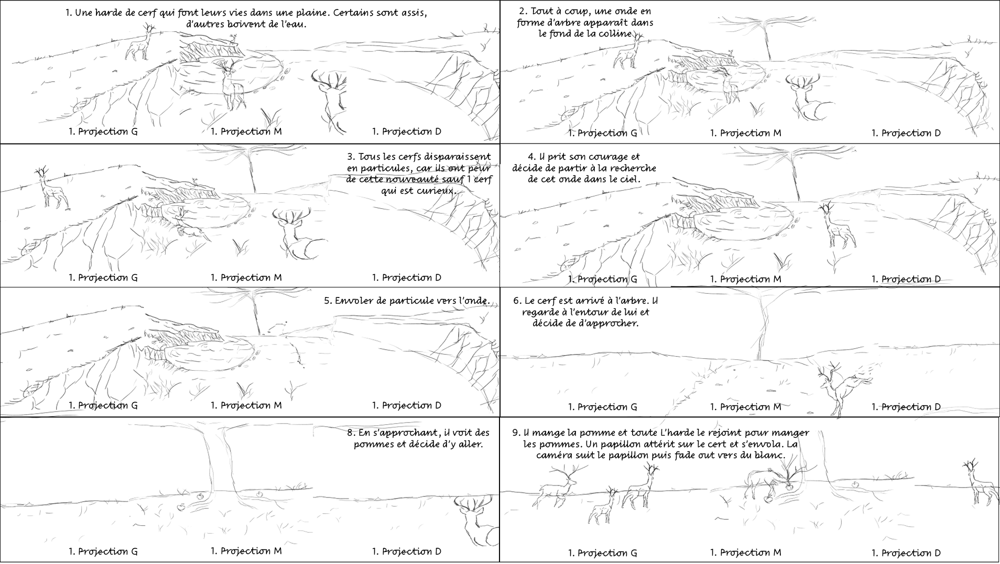

# Journal de création

## Semaine 1
### Préproduction et préparation

Cette semaine a été consacrée à repenser le projet et adapter la préproduction.

La majorité de la semaine fût occupée par des rencontres d'équipes plutôt productives qui nous on permis de complètement revoir le projet et d'avoir une meilleure idée de la direction du projet.
(Photo à changer)

Nous avons également prit le temps de parler avec les TTPs et Guillaume pour cibler les défis à relever pour la mise en espace. Il semble que le positionement actuel des projecteurs posera problème et devra être revu. Plusieurs pistes ont été nommées dont une impliquant des miroirs qui seront testés dans les prochaines semaines.
(Photo à changer)

La journée de jeudi était réservé pour tous afin de trouver le thème et le titre de l'exposition. Le titre final choisi fût finalement Crescentia, qui signifie "Croissance" en grec, une idée d'un membre de l'équipe. Toutes les équipes ont été chargées de produire des textes pour la semaine suivante decrivant par exemple comment leur installation apportais au thème général.

Finalement, quelques médias ont été crées comme une image d'inspiration qui a mené à l'installation, un modèle 3D de l'espace et de la structure principale et un environnement sonore.
(Photo à changer)

Nous sommes bien heureux de ce qui a été accompli et avons hâte de voir comment le projet évoluera! À la semaine prochaine!

## Semaine 2
### Préparation et mise en place

La deuxième semaine a été marquée par une phase d'arrangement final de la préproduction. Également, la création de la vidéo d'intention qui a été écrit, filmé et monté lors de cette semaine. L'équipe s'est concentrées sur plusieurs aspects du projet notamment les premiers essais afin de créer la structure qui supportera les écrans mais aussi trouver comment envoyer des images/vidéos en NDI dans les écrans grâce à TouchDesigner.

Il y avait une problèmatique liées à la structure qui était au milieu de la projection qui nous a amené à tester des possibilité de projection soit à l'aide de deux projecteurs ou à l'aide d'un miroir redirigé la projection. Notre choix s'est arrêté sur l'utilisation de deux projecteurs.

Maintenant d'un point de vue technique, nous avons installé les quatres projecteurs et les quatres enceintes nécessaires. Des tests à l'aide des logiciels arduino et hyperhdr ont été fait afin de comprendre le fonctionnement des fairylights soudés aux M5Stack atom.

Finalement, l'ambiance sonore du projet a été conçu afin d'avoir notre bande son ainsi que de s'assurer que celle-ci allait avec notre direction artistique.

## Semaine 3
### Affinage des détails visuels et techniques

La troisième semaine a été une semaine de premiers tests. Pour le côté lié à l'installation, nous avons fait les premiers arrangement sur les keystones des projecteurs afin qu'ils soient semblable au mur et que la projection soit de la bonne taille. L'accrochage d'une fairylight a également été effectué afin de pouvoir commencer la scénarisation de celle-ci.

Les premiers visuels d'essais ont été créés afin de pouvoir programmer et essayer de les ajouter à notre programme dans TouchDesigner. Notre programme qui a d'ailleeurs vu son objet "Delay" remplacer par un "Timer" puisque celui-ci correspond mieux à notre projet. Ce qui nous a permis de connecter notre objet "Timer" avec nos premiers visuels d'essais afin de programmer le tout.

Malheureusement, lors de cette semaine, notre coéquipier William Morel a fait une chute lors d'une sortie en extérieur. Il a attrapé une commotion en début de semaine ce qui est venu donner un coup au moral de l'équipe et donc nous a ralenti sur notre projet. 

En conclusion, cette semaine a été plus difficille ce qui ne nous a tout de même pas empêcher de bien commencer les premiers essais avec notre programme. Nous souhaitons à William un bon rétablissement et nous espérons qu'ils reviennent en force la semaine prochaine!

## Semaine 4
### Intégration et ajustements

La quatrième semaine a été dédiée à l'intégration des différents éléments du projet et à la réalisation d'ajustements pour l'expérience.

Tout d'abord, du code en arduino a été effectué afin que nos objets envoit des messages en osc et quee l'on puisse les reecevoir dans notre programme dans TouchDesigner. De nouveaux sons et de nouveaux visuels ont également été intégré à notre programme eet aussi les vidéos afin de contrôler les fairylights. L'organisation du moment final a également été programmé.

L'accrochage de la majorité des fairylights a été effectué. D'ailleurs, nous avons trouver une alternative à la soudure. À la place, nous avons simplement besoin d'utiliser des Unit VH3.96 afin d'asssurer la liaison avec les atom poe. De plus, nous avons rendus les fairylights adressable.

Pour la séquence de fin projeter sur les murs, nous avons discuter en équipe et effectuer un storyboard afin qu'on soit tous d'accord sur la direction que l'animation allait prendre. Nous avons commencer la modélisation et le rigginf d'un cerf. Les effets ont aussi commeencer à être effectués dans Houdini.

En résumé, la programmation, l'installation et la modélisation de l'installation avance très bien! Nous sommes impatients de continuer le tout la semaine prochaine.

## Semaine 5
### Finalisation et résolution des problèmes

Pour cette cinquième semaine, nous avons travaillé sur l'ajustement des intéractions et la mise en espace. Aussi, nous avons commencé à intégrer les sons et les visuels finaux dans l'espace. Chacune des personnes de l'équipe ont effectués leurs tâches assignés.

Pour ce qui est des intéractions, des ajustements ont été apportés pour résoudre un problème technique lié au fonctionnement du slider et de la poulie. Aussi nous avons installé la switch pour les ports internet ce qui facilite la connectivité réseau.

Par ailleurs, nous avons travailler sur la mise en espace final des intéractions pour une optimisations de l'expérience.

Pour finir cette semaine, nous avons ajouter des visuels finaux dans les écrans des RasberryPI, comme la pluie, et nous avons fait des tests des visuels des arbres sur les projecteurs.

Au cours de cette semaine, l'accent a été mis sur la résolution des problèmes de dernière minute et sur l'optimisation de l'ensemble de l'installation. L'équipe a travaillé avec détermination pour atteindre les objectifs fixés et assurer le succès de l'événement.

## Semaine 6

## Semaine de rattrapage

## Semaine 7

## Semaine 8

## Semaine 9

