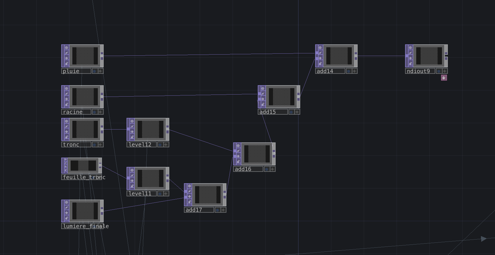

# Journal de "Participant 2"

* [Semaine 1](#semaine-1)
* [Semaine 2](#semaine-2)
* [Semaine 3](#semaine-3)
* [Semaine 4](#semaine-4)
* [Semaine 5](#semaine-5)
* [Semaine de rattrapage](#semaine-de-rattrapage)
* [Semaine 6](#semaine-6)
* [Semaine 7](#semaine-7)
* [Semaine 8](#semaine-8)
* [Semaine 9](#semaine-9)

## Semaine 1

### Résumé des réalisations effectuées
- Trouver un projet cohérent et complet
- Réflexion sur l'installation dans le petit studio 
- Début de réflexion de la structure
- Problème du poteau qui vient cacher une partie de la projection
- Test à l'aide d'un miroir et d'un projecteur

### Image d'une réalisation dont tu es la ou le plus fier

### Est-ce que j'ai accompli l'ensemble des tâches et objectifs que je m'étais fixés pour cette semaine?	
- [ ] Complètement
- [x] Assez
- [ ] Peu
- [ ] Pas du tout

#### Décrivez pourquoi.
On a beaucoup brainstormer en équipe afin de bien détailler le projet et d'être sûr d'avoir une idée précise du résultat final, cependant il nous manquait un peu d'organisation qui nous aurait permis d'être plus efficace.

#### S'il y a lieu, qu'allez-vous faire pour remédier à la situation?
Une organisation plus clair et plus détaillé des tâches à effectuer en équipe.

### Mon projet s'est-il réalisé selon l’échéancier prévu?

- [ ] Complètement
- [x] Assez
- [ ] Un peu
- [ ] Pas tout à fait

#### S'il y a des écarts, décrivez-les.
Je pense que l'on aurais pu avancer davantage si nous n'avions pas changer de projet mardi, mais désormais nous avons un projet cohérent.

### Défis pour la prochaine semaine
Le défi principal de la semaine prochaine est la création de notre vidéo de présentation de notre projet. Pour ma part, je m'occuperais de rédiger le script et de monter cette vidéo. Il y a aussi des questions à répondre pour le jeudi artistique.

---
## Semaine 2
### Résumé des réalisations effectuées
- Arrangement final de la préproduction
- Devoir pour le jeudi artistique
- Test de projection double sur le mur
- Écriture du script de la vidéo d'intention
- Envoi de vidéo en NDI grâce à TouchDesigner sur les écrans connecter au rasberry pi
- Séparation d'une image en plusieurs écrans grâce à TouchDesigner
- Installation des projecteurs et des speakers dans le petit studio
- Test d'installation de la structure
- Tournage de la vidéo d'intention
- Montage de la vidéo d'intention

### Image d'une réalisation dont tu es la ou le plus fier

### Est-ce que j'ai accompli l'ensemble des tâches et objectifs que je m'étais fixés pour cette semaine?

- [x] Complètement
- [ ] Assez
- [ ] Peu
- [ ] Pas du tout

#### Décrivez pourquoi.
 J'ai travailler beeaucoup cette semaine. Je suis rester toute la semaine à l'écolee afin d'avancer l'installation dans le petit studio. Au vu des étapes que j'ai avancé cette semaine, je pense avoir complétement voir plus avancé que ce que je pensais.

### Mon projet s'est-il réalisé selon l’échéancier prévu?

- [x] Complètement
- [ ] Assez
- [ ] Un peu
- [ ] Pas tout à fait

### Défis pour la prochaine semaine
Le principal défi pour la semaine prochaine sera d'avoir un test de séquence qui se suit, comme par exemple, l'appui du bouton qui déclenche l'animation et la musique. Il sera aussi important de vérifier la fonctionnalité des speakers et des projecteurs afin d'avoir le résultat voulu.

---
## Semaine 3 
### Résumé des réalisations effectuées
- Arrangement des keystones sur les projecteurs
- Création de visuels tests (Arbres, graines, pousse)
- Connection entre la state machine et les visuels tout deux dans TouchDesigner
- Transformer certaines données pour venir affecter les visuels
- Modification de la state machine avec l'item timer

### Image d'une réalisation dont tu es la ou le plus fier

### Est-ce que j'ai accompli l'ensemble des tâches et objectifs que je m'étais fixés pour cette semaine?

- [ ] Complètement
- [x] Assez
- [ ] Peu
- [ ] Pas du tout

#### Décrivez pourquoi.
J'ai eu le temps de faire des visuels tests ainsi que de les relier à notre système dans TouchDesigner afin recevoir lees données et afficher les bons visuels au bon moment cependant ceux ci ne sont pas encore relier avec les capteurs m5stack que nous utilisons.

#### S'il y a lieu, qu'allez-vous faire pour remédier à la situation?
La semaine prochaine, je compte faire de ma priorité la connexion avec le système arduino pour s'assurer que toute les valeurs reçu soient les bonnes et sont bien reçus.

### Mon projet s'est-il réalisé selon l’échéancier prévu?

- [ ] Complètement
- [ ] Assez
- [x] Un peu
- [ ] Pas tout à fait

#### S'il y a des écarts, décrivez-les.
Cette semaine, notre coéquipier William Morel s'est retrouvé à l'hôpital dû à unee commotion ce qui a tout d'abord mis un coup au moral de l'équipe. Aussi, le projet avance forcément moins bien avec un coéquipier manquant dans l'équipe.

#### S'il y a lieu, qu'allez-vous faire pour remédier à la situation?
Le but est évidemment de mieux diviser les tâches du coéquipier manquant et de mieux s'organiser en conséquence. Aussi, il faudrait se parler davantage en équipe pour voir nos avancées sur le projet.

### Défis pour la prochaine semaine
Le défi principale pour la semaine prochaine est d'avoir une maquette complète du projet final à présenter. Il faut donc s'assurer que notre système récupère les données envoyé par les m5stack atom dans notre système et d'envoyer au bon moment la musique, les visuels et les lumière tout cela dans TouchDesigner.

---
## Semaine 4
### Résumé des réalisations effectuées
- Recevoir des messages osc envoyés par les m5stack atom
- Synchronisation des sons dans TouchDesigner avec la machine
- Synchronisation des visuels tests dans TouchDesigner avec la machine
- Synchronisation des lumières/vidéos dans TouchDesigner avec la machine
- Organisation du moment final dans TouchDesigner
- Début de la construction des objets (valve)

### Image d'une réalisation dont tu es la ou le plus fier

### Est-ce que j'ai accompli l'ensemble des tâches et objectifs que je m'étais fixés pour cette semaine?

- [x] Complètement
- [ ] Assez
- [ ] Peu
- [ ] Pas du tout

#### Décrivez pourquoi.
 J'ai réussi à faire fonctionner tout notre code dans TouchDesigner afin de recevoir les messages osc envoyé dans notre logiciel TouchDesigner afin de déclencher au bon moment, les visuels, les lumières ainsi que les sons. Ce qui permet d'avoir une maquette présentable et un bon apercu du résultat final de notre installation malgré que les visuels ne soient pas les finaux. 

### Mon projet s'est-il réalisé selon l’échéancier prévu?

- [ ] Complètement
- [x] Assez
- [ ] Un peu
- [ ] Pas tout à fait

#### S'il y a des écarts, décrivez-les.
Je pense que pour la démonstration de la maquette, certains visuels représentant nos visuels finaux auraient été un bon ajout à l'installation. Cependant, nous avons le sons d'ambiance final.

#### S'il y a lieu, qu'allez-vous faire pour remédier à la situation?
L'idée est de commencer à travailler le plus rapidement possible sur les visuels finaux, les lumière et les bruitages sachant que le fonctionnement de l'installation est finalisé.

### Défis pour la prochaine semaine
Pour la semaine prochaine, je compte commencer à travailler sur les visuels finaux diffuser dans les écrans lors des différentes étapes et les intégrer à notre patch TouchDesigner qui contrôle les séquences.

---
## Semaine 5
### Résumé des réalisations effectuées
- Arranger le problème lié au slider
- Fixer les poulies pour le mécanisme de la pomme
- Installation de la switch pour les port internet
- Finalisation de réflexion sur le placement de la structure
- Ajouter le visuel final de la pluie
- Ajout des premiers effets sonores
- Arrangement du son
- Synchroniser nos lumières en USB avec notre système
- Modification de l’assemblage sonore lors de l’expérience
- Test complet de l’ensemble du mécanisme avec tout les messages osc reçu et tout le matériel diffusé (visuel,audio,lumière)
- Test du nouveau visuel de l’arbre

### Image d'une réalisation dont tu es la ou le plus fier

### Est-ce que j'ai accompli l'ensemble des tâches et objectifs que je m'étais fixés pour cette semaine?

- [ ] Complètement
- [x] Assez
- [ ] Peu
- [ ] Pas du tout

#### Décrivez pourquoi.
Le cycle de la machine fonctionne parfaitement. Le système fonctionne avec les objets reliés au m5stack atom pour la majorité. Il réagit même avec les lumières brancher en USB grâce à un contrôle dans TouchDesigner. Certains visuels finaux ont commencé à être ajouté. Plusieurs problèmes reliés au branchement ont égaleement été règlés.

#### S'il y a lieu, qu'allez-vous faire pour remédier à la situation?
Je vais m'occuper de vérifier que la valve et la poulie en fonction des valeurs qu'ils envoient puissent être reçu et déclenche au moment voulu le système dans TouchDesigner.

### Mon projet s'est-il réalisé selon l’échéancier prévu?

- [x] Complètement
- [ ] Assez
- [ ] Un peu
- [ ] Pas tout à fait

#### S'il y a des écarts, décrivez-les.

#### S'il y a lieu, qu'allez-vous faire pour remédier à la situation?

### Défis pour la prochaine semaine
Pour la semaine prochaine, le but serait de tester notamment la valve et la poulie avec le système. Aussi de commencer à faire l'installation finale de la structure en positionnant des objets comme le bouton ou la valve à leur endroit final. Positionner pour l'installation finale.

---
## Semaine de rattrapage
### Résumé des réalisations effectuées

### Image d'une réalisation dont tu es la ou le plus fier

### Est-ce que j'ai accompli l'ensemble des tâches et objectifs que je m'étais fixés pour cette semaine?

- [ ] Complètement
- [ ] Assez
- [ ] Peu
- [ ] Pas du tout

#### Décrivez pourquoi.
 

#### S'il y a lieu, qu'allez-vous faire pour remédier à la situation?

### Mon projet s'est-il réalisé selon l’échéancier prévu?

- [ ] Complètement
- [ ] Assez
- [ ] Un peu
- [ ] Pas tout à fait

#### S'il y a des écarts, décrivez-les.

#### S'il y a lieu, qu'allez-vous faire pour remédier à la situation?

### Défis pour la prochaine semaine

---
## Semaine 6
### Résumé des réalisations effectuées

### Image d'une réalisation dont tu es la ou le plus fier

### Est-ce que j'ai accompli l'ensemble des tâches et objectifs que je m'étais fixés pour cette semaine?

- [ ] Complètement
- [ ] Assez
- [ ] Peu
- [ ] Pas du tout

#### Décrivez pourquoi.
 

#### S'il y a lieu, qu'allez-vous faire pour remédier à la situation?

### Mon projet s'est-il réalisé selon l’échéancier prévu?

- [ ] Complètement
- [ ] Assez
- [ ] Un peu
- [ ] Pas tout à fait

#### S'il y a des écarts, décrivez-les.

#### S'il y a lieu, qu'allez-vous faire pour remédier à la situation?

### Défis pour la prochaine semaine

---
## Semaine 7
### Résumé des réalisations effectuées

### Image d'une réalisation dont tu es la ou le plus fier

### Est-ce que j'ai accompli l'ensemble des tâches et objectifs que je m'étais fixés pour cette semaine?

- [ ] Complètement
- [ ] Assez
- [ ] Peu
- [ ] Pas du tout

#### Décrivez pourquoi.
 

#### S'il y a lieu, qu'allez-vous faire pour remédier à la situation?

### Mon projet s'est-il réalisé selon l’échéancier prévu?

- [ ] Complètement
- [ ] Assez
- [ ] Un peu
- [ ] Pas tout à fait

#### S'il y a des écarts, décrivez-les.

#### S'il y a lieu, qu'allez-vous faire pour remédier à la situation?

### Défis pour la prochaine semaine

## Semaine 8

## Semaine 9
