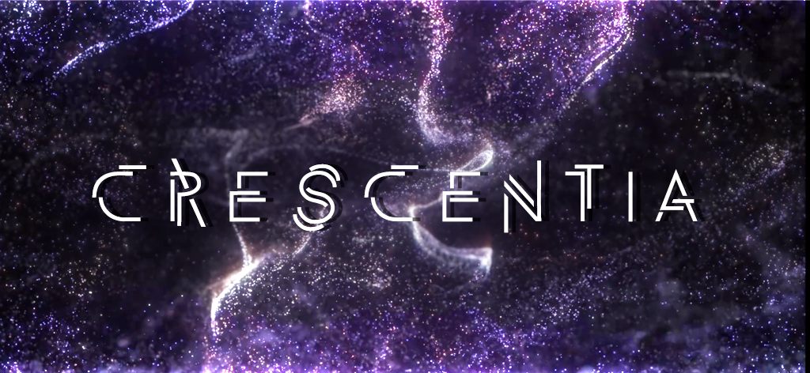

# Journal de Jasmine Lapierre

* [Semaine 1](#semaine-1)
* [Semaine 2](#semaine-2)
* [Semaine 3](#semaine-3)
* [Semaine 4](#semaine-4)
* [Semaine 5](#semaine-5)
* [Semaine de rattrapage](#semaine-de-rattrapage)
* [Semaine 6](#semaine-6)
* [Semaine 7](#semaine-7)
* [Semaine 8](#semaine-8)
* [Semaine 9](#semaine-9)

## Semaine 1

### Résumé des réalisations effectuées
- Brainstorming en équipe
- Commencer la réflexion sur le design du logo et de la bannière de Crescentia.

### Image d'une réalisation dont tu es la ou le plus fier

### Est-ce que j'ai accompli l'ensemble des tâches et objectifs que je m'étais fixés pour cette semaine?	
- [ ] Complètement
- [x] Assez
- [ ] Peu
- [ ] Pas du tout

#### Décrivez pourquoi.
Le but de notre première semaine était de trouver une idée de projet qui pouvait plaire à tous les membres de l'équipe et nous l'avons trouvée. J'aurais pu être plus proactive lors des rencontres.

#### S'il y a lieu, qu'allez-vous faire pour remédier à la situation?
Mieux dormir avant les rencontres et bien manger pour m'aider à réfléchir et participer efficacement aux discussions de groupe.

### Mon projet s'est-il réalisé selon l’échéancier prévu?

- [ ] Complètement
- [x] Assez
- [ ] Un peu
- [ ] Pas tout à fait

### Défis pour la prochaine semaine
- Coordonner la création de la bannière et du logo de Crescentia. 
- Participer à la répartition des tâches.

---
## Semaine 2
### Résumé des réalisations effectuées
Réalisation du logo de l'évènement et mise à jour des tableaux de la préproduction.

### Image d'une réalisation dont tu es la ou le plus fier

### Est-ce que j'ai accompli l'ensemble des tâches et objectifs que je m'étais fixés pour cette semaine?

- [X] Complètement
- [ ] Assez
- [ ] Peu
- [ ] Pas du tout

#### Décrivez pourquoi.
J'ai fait ce que j'avais à faire.

#### S'il y a lieu, qu'allez-vous faire pour remédier à la situation?

### Mon projet s'est-il réalisé selon l’échéancier prévu?

- [X] Complètement
- [ ] Assez
- [ ] Un peu
- [ ] Pas tout à fait

#### S'il y a des écarts, décrivez-les.

#### S'il y a lieu, qu'allez-vous faire pour remédier à la situation?

### Défis pour la prochaine semaine
Apporter les modifications au logo selon ce qui a été demandé à la rencontre du jeudi artistique.
Faire un plan de mise en espace de la structure principale, des lumières, des racines et de la structure pour la valve.
Faire fonctionner les 2 projecteurs ensemble.

---
## Semaine 3 
### Résumé des réalisations effectuées
- logo terminé.
- keystones des deux projecteurs pour qu'ils projetent l'image sans l'ombre du pôle au milieu.
- Mise à jour de la feuille excel du budget. Le materiel se fait ajouter automatiquement à la feuille lorsqu'il est ajouté à la liste de matériel.
- Liste de tous les medias à creer + issues assignées
- Liste d'éléments à mettre dans le plan de mise en espace (nombre et longueur des lumieres, repartition des interactions dans la salle etc.)
### Image d'une réalisation dont tu es la ou le plus fier
 

### Est-ce que j'ai accompli l'ensemble des tâches et objectifs que je m'étais fixés pour cette semaine?

- [ ] Complètement
- [x] Assez
- [ ] Peu
- [ ] Pas du tout

#### Décrivez pourquoi.
je n'ai pas fait le plan.

#### S'il y a lieu, qu'allez-vous faire pour remédier à la situation?
je vais faire le plan

### Mon projet s'est-il réalisé selon l’échéancier prévu?

- [ ] Complètement
- [x] Assez
- [ ] Un peu
- [ ] Pas tout à fait

#### S'il y a des écarts, décrivez-les.

je n'ai pas fait le plan, car j'ai sous-estimé le temps que ca allait prendre de poser les bonnes questions à l'équipe et de s'assurer qu'on est tous sur la même page.
#### S'il y a lieu, qu'allez-vous faire pour remédier à la situation?
Faire le plan d'ici la semaine prochaine

### Défis pour la prochaine semaine
---

M'assurer que les rideaux de projection soient repassées et aient lair professionnels. trouver une manière de les lier ensemble. faire le plan de mise en espace.
## Semaine 4
### Résumé des réalisations effectuées
Le plan n'a pas été fait, car finalement il n'était pas nécessaire de le refaire.
Cette semaine j'ai nettoyé la machine à vapeur au vinaigre, puis j'ai repassé les rideaux.
Ensuite, j'ai commencé à faire de la recherche artistique pour la projection de cerfs et j'ai participé à la rencontre d'équipe pour le synopsis du mini film.

### Image d'une réalisation dont tu es la ou le plus fier
 

### Est-ce que j'ai accompli l'ensemble des tâches et objectifs que je m'étais fixés pour cette semaine?

- [ ] Complètement
- [x] Assez
- [ ] Peu
- [ ] Pas du tout

#### Décrivez pourquoi.
 Tout à été fait mais j'aurais aimé avancer un peu plus en 3D

#### S'il y a lieu, qu'allez-vous faire pour remédier à la situation?

### Mon projet s'est-il réalisé selon l’échéancier prévu?

- [ ] Complètement
- [x] Assez
- [ ] Un peu
- [ ] Pas tout à fait

#### S'il y a des écarts, décrivez-les.

#### S'il y a lieu, qu'allez-vous faire pour remédier à la situation?

### Défis pour la prochaine semaine

---
## Semaine 5
### Résumé des réalisations effectuées
- Réaccrochage des rideaux pour qu'ils soient ininterrompus.
- Création des assets d'arbres pour les écrans et rendus des 8 caméras
- Création de l'effet de particules pour les cerfs et la terre
- Test pour les rendus de cerfs animés et de la terre (Taille/nombre/couleur des particules)
- Création et rendu de l'explosion.
### Image d'une réalisation dont tu es la ou le plus fier

 
 

https://github.com/Iteration6/Effet-Papillon/assets/89647613/4398d8e0-336b-455b-833b-76614fbb5246

https://github.com/Iteration6/Effet-Papillon/assets/89647613/852943c3-3269-4cc5-a80f-34b69eecf937

https://github.com/Iteration6/Effet-Papillon/assets/89647613/63c9a871-7e18-4c94-bba0-653854b459b7

### Est-ce que j'ai accompli l'ensemble des tâches et objectifs que je m'étais fixés pour cette semaine?

- [x] Complètement
- [ ] Assez
- [ ] Peu
- [ ] Pas du tout

#### Décrivez pourquoi.
 

#### S'il y a lieu, qu'allez-vous faire pour remédier à la situation?

### Mon projet s'est-il réalisé selon l’échéancier prévu?

- [x] Complètement
- [ ] Assez
- [ ] Un peu
- [ ] Pas tout à fait

#### S'il y a des écarts, décrivez-les.

#### S'il y a lieu, qu'allez-vous faire pour remédier à la situation?

### Défis pour la prochaine semaine

---
## Semaine 6
### Résumé des réalisations effectuées
- Re-création des assets 3D de l'arbre pour les animations sur les écrans de la structure.
- Ajout des effets sur les rendus de l'arbre.
- Création et animation de l'herbe.
- Test sur l'ajout de l'eau à la terre.
- Tests généraux de la scène 3D.

### Image d'une réalisation dont tu es la ou le plus fier

 

https://github.com/Iteration6/Effet-Papillon/assets/89647613/bf72103c-f96c-4ee3-bd1c-17157b416acc

https://github.com/Iteration6/Effet-Papillon/assets/89647613/3228cd38-1a4a-4aed-87ca-5476aebb8a4a

### Est-ce que j'ai accompli l'ensemble des tâches et objectifs que je m'étais fixés pour cette semaine?

- [x] Complètement
- [ ] Assez
- [ ] Peu
- [ ] Pas du tout

#### Décrivez pourquoi.
 

#### S'il y a lieu, qu'allez-vous faire pour remédier à la situation?

### Mon projet s'est-il réalisé selon l’échéancier prévu?

- [x] Complètement
- [ ] Assez
- [ ] Un peu
- [ ] Pas tout à fait

#### S'il y a des écarts, décrivez-les.

#### S'il y a lieu, qu'allez-vous faire pour remédier à la situation?

### Défis pour la prochaine semaine

---
## Semaine de rattrapage
### Résumé des réalisations effectuées
- fin de tous les rendus
- Montage du mini-film.
- Tests de colorimétrie des rendus / montage.

### Image d'une réalisation dont tu es la ou le plus fier
 

### Est-ce que j'ai accompli l'ensemble des tâches et objectifs que je m'étais fixés pour cette semaine?

- [x] Complètement
- [ ] Assez
- [ ] Peu
- [ ] Pas du tout

#### Décrivez pourquoi.
 

#### S'il y a lieu, qu'allez-vous faire pour remédier à la situation?

### Mon projet s'est-il réalisé selon l’échéancier prévu?

- [x] Complètement
- [ ] Assez
- [ ] Un peu
- [ ] Pas tout à fait

#### S'il y a des écarts, décrivez-les.

#### S'il y a lieu, qu'allez-vous faire pour remédier à la situation?

### Défis pour la prochaine semaine

---
## Semaine 7
### Résumé des réalisations effectuées
- finir le montage du mini film et colo
- réaliser que c'est vraiment laid comme composition visuelle sur des projections
- nouvelle conception du minifilm final en style plus 2D
- création et rendu des pommes pour la projection.
- création et rendu de la pluie pour la projection.
- création et rendus de 3 nouveaux arbres pour la projection.
- Re-création du cerf, car le résultat n'était pas de beauté optimale (crissement laid)
- Rendus finaux de la terre et de l'eau

### Image d'une réalisation dont tu es la ou le plus fier

### Est-ce que j'ai accompli l'ensemble des tâches et objectifs que je m'étais fixés pour cette semaine?

- [x] Complètement
- [ ] Assez
- [ ] Peu
- [ ] Pas du tout

#### Décrivez pourquoi.
 

#### S'il y a lieu, qu'allez-vous faire pour remédier à la situation?

### Mon projet s'est-il réalisé selon l’échéancier prévu?

- [x] Complètement
- [ ] Assez
- [ ] Un peu
- [ ] Pas tout à fait

#### S'il y a des écarts, décrivez-les.

#### S'il y a lieu, qu'allez-vous faire pour remédier à la situation?

### Défis pour la prochaine semaine

## Semaine 8 (18 au 23 mars)

## Semaine 9
