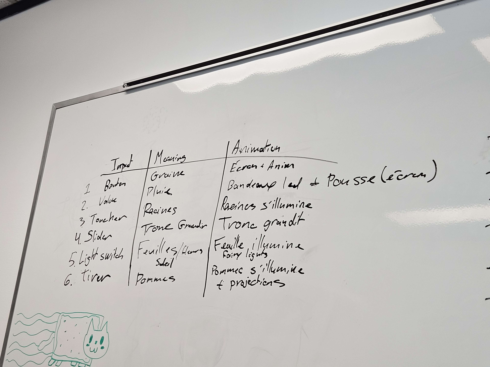
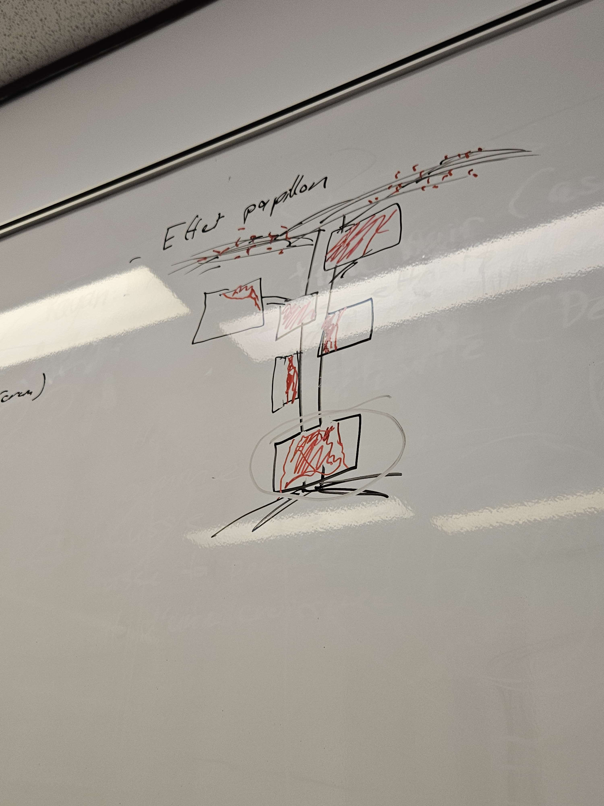
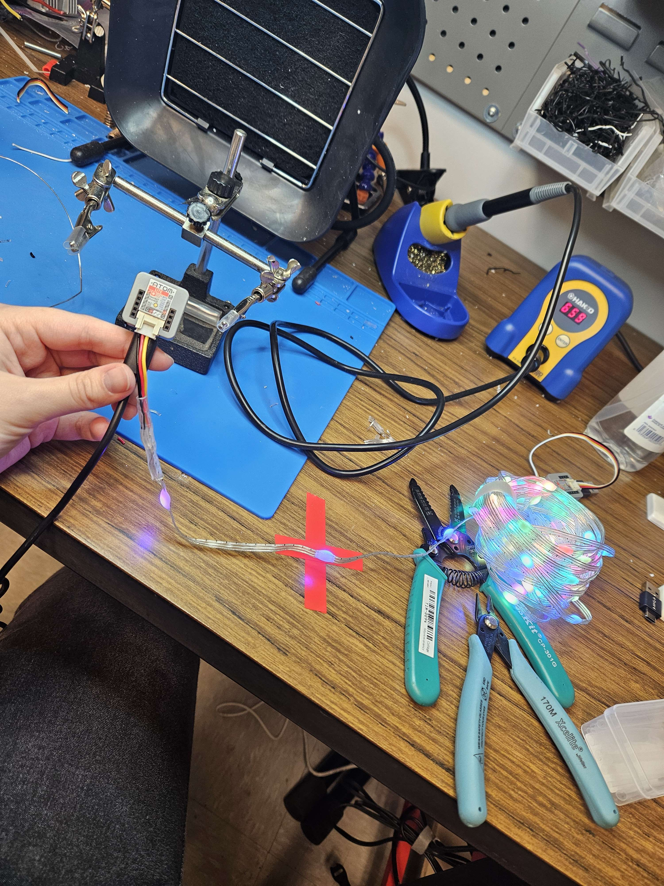
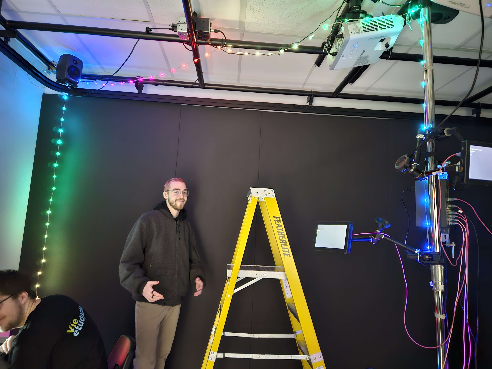
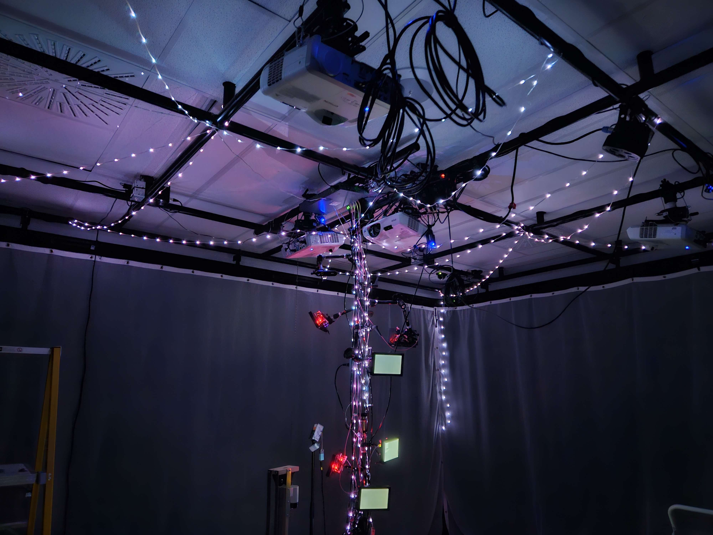

# Journal de "Participant 4"

* [Semaine 1](#semaine-1)
* [Semaine 2](#semaine-2)
* [Semaine 3](#semaine-3)
* [Semaine 4](#semaine-4)
* [Semaine 5](#semaine-5)
* [Semaine de rattrapage](#semaine-de-rattrapage)
* [Semaine 6](#semaine-6)
* [Semaine 7](#semaine-7)
* [Semaine 8](#semaine-8)
* [Semaine 9](#semaine-9)

## Semaine 1

### Résumé des réalisations effectuées
- Organisation du projet d'origine (celui élaboré avant les vacances d'hiver)
- Brainstorm d'un nouveau concept de projet pour remplacer celui d'origine.
- Organisation du nouveau projet.
- Se renseigner sur les technologies nécessaires à la réalisation du projet.
- Mise en place d'un système d'acquisation de tâches au sein de l'équipe.

### Image d'une réalisation dont tu es la ou le plus fier

ou

### Est-ce que j'ai accompli l'ensemble des tâches et objectifs que je m'étais fixés pour cette semaine?	
- [x] Complètement
- [ ] Assez
- [ ] Peu
- [ ] Pas du tout

#### Décrivez pourquoi.
Cette semaine était majoritairement une semaine propice à l'organisation et au brainstorm. Je suis resté plusieurs fois plus longtemps après les cours pour m'occuper avec mes coéquipiers des détails de notre concept de projet. 

#### S'il y a lieu, qu'allez-vous faire pour remédier à la situation?
Aucune situation à remédier.

### Mon projet s'est-il réalisé selon l’échéancier prévu?

- [x] Complètement
- [ ] Assez
- [ ] Un peu
- [ ] Pas tout à fait

#### S'il y a des écarts, décrivez-les.
Aucun écart.

#### S'il y a lieu, qu'allez-vous faire pour remédier à la situation?
Aucune situation à remédier.

### Défis pour la prochaine semaine
Je dois conceptualiser le logo et la bannière de notre équipe et il y aura sûrement d'autres tâches qui me seront attribuées au courant de la semaine.

---
## Semaine 2
### Résumé des réalisations effectuées
J'ai fait le logo et la bannière du projet de notre équipe. J'ai aussi appris davantage sur comment je vais pouvoir faire fonctionner les lumières en harmonie avec le reste de l'installation. J'ai fait de la soudure sur nombreuses strip de fairy lights pour les rendrent addressable avec un atom m5 stack. 

### Image d'une réalisation dont tu es la ou le plus fier

### Est-ce que j'ai accompli l'ensemble des tâches et objectifs que je m'étais fixés pour cette semaine?

- [x] Complètement
- [ ] Assez
- [ ] Peu
- [ ] Pas du tout

#### Décrivez pourquoi.
 J'ai fait plus que ce que je m'étais fixé, au début je pensais juste faire le logo et la bannière ainsi qu'un peu d'exploration concernant la technologie utilisée pour les lumières.

#### S'il y a lieu, qu'allez-vous faire pour remédier à la situation?

### Mon projet s'est-il réalisé selon l’échéancier prévu?

- [x] Complètement
- [ ] Assez
- [ ] Un peu
- [ ] Pas tout à fait

#### S'il y a des écarts, décrivez-les.

#### S'il y a lieu, qu'allez-vous faire pour remédier à la situation?

### Défis pour la prochaine semaine
Continuer la soudure des fairy lights
Agencer touch designer au déclenchement des lumières

---
## Semaine 3 
### Résumé des réalisations effectuées
- Accrochage de lumières
- Scénarisation de l'emplacement des lumières

### Image d'une réalisation dont tu es la ou le plus fier

### Est-ce que j'ai accompli l'ensemble des tâches et objectifs que je m'étais fixés pour cette semaine?

- [ ] Complètement
- [ ] Assez
- [x] Peu
- [ ] Pas du tout

#### Décrivez pourquoi.
 J'ai accompagné mon coéquipier William à l'hôpital donc j'ai dû manquer une journée de travail. De plus, je m'inquietais pour son étât alors ma productivité était diminué.

#### S'il y a lieu, qu'allez-vous faire pour remédier à la situation?

### Mon projet s'est-il réalisé selon l’échéancier prévu?

- [ ] Complètement
- [x] Assez
- [ ] Un peu
- [ ] Pas tout à fait

#### S'il y a des écarts, décrivez-les.
J'aurais voulu faire fonctionner mes lumières simultanément cette semaine mais je n'ai pas pu, à cause de la situation mentionné ci-dessus.

#### S'il y a lieu, qu'allez-vous faire pour remédier à la situation?

### Défis pour la prochaine semaine
- Faire fonctionner mes lumières simultanément
- Mapping vidéo de l'animation des lumières.
---
## Semaine 4
### Résumé des réalisations effectuées
- Réussite sur le fonctionnement de plusieurs fairy lights simultanées.
- Programmation des esp32 pour rendre les fairy lights addressable.

### Image d'une réalisation dont tu es la ou le plus fier

### Est-ce que j'ai accompli l'ensemble des tâches et objectifs que je m'étais fixés pour cette semaine?

- [x] Complètement
- [ ] Assez
- [ ] Peu
- [ ] Pas du tout

#### Décrivez pourquoi.
 J'ai régler les défis de la semaine passée.

#### S'il y a lieu, qu'allez-vous faire pour remédier à la situation?

### Mon projet s'est-il réalisé selon l’échéancier prévu?

- [x] Complètement
- [ ] Assez
- [ ] Un peu
- [ ] Pas tout à fait

#### S'il y a des écarts, décrivez-les.

#### S'il y a lieu, qu'allez-vous faire pour remédier à la situation?

### Défis pour la prochaine semaine
Continuer l'accrochage des lumières et s'assurer de la connectivité à hyper HDR des 10 fairy lights.

---
## Semaine 5
### Résumé des réalisations effectuées
- Accrochage de la moitié des fairy lights (en s'assurant de ne pas créer d'ombre au niveau des projections)
- Remplacement du besoin de soudure par des Unit VH3.96

### Image d'une réalisation dont tu es la ou le plus fier

### Est-ce que j'ai accompli l'ensemble des tâches et objectifs que je m'étais fixés pour cette semaine?

- [x] Complètement
- [ ] Assez
- [ ] Peu
- [ ] Pas du tout

#### Décrivez pourquoi.
J'ai pris de l'avance sur mes tâches grâce à la solution de Thomas de ne pas effectuer de la soudure mais plutôt utiliser des Unit VH3.96. Donc, j'ai pu accrocher plus de lumières que prévu.

#### S'il y a lieu, qu'allez-vous faire pour remédier à la situation?

### Mon projet s'est-il réalisé selon l’échéancier prévu?

- [x] Complètement
- [ ] Assez
- [ ] Un peu
- [ ] Pas tout à fait

#### S'il y a des écarts, décrivez-les.

#### S'il y a lieu, qu'allez-vous faire pour remédier à la situation?

### Défis pour la prochaine semaine
 Finir l'accrochage des lumières et régler le bug de fairy lights qui deviennent rouge et vert un fois la séquence de mapping complétée.

---
## Semaine de rattrapage
### Résumé des réalisations effectuées

### Image d'une réalisation dont tu es la ou le plus fier

### Est-ce que j'ai accompli l'ensemble des tâches et objectifs que je m'étais fixés pour cette semaine?

- [ ] Complètement
- [ ] Assez
- [ ] Peu
- [ ] Pas du tout

#### Décrivez pourquoi.
 

#### S'il y a lieu, qu'allez-vous faire pour remédier à la situation?

### Mon projet s'est-il réalisé selon l’échéancier prévu?

- [ ] Complètement
- [ ] Assez
- [ ] Un peu
- [ ] Pas tout à fait

#### S'il y a des écarts, décrivez-les.

#### S'il y a lieu, qu'allez-vous faire pour remédier à la situation?

### Défis pour la prochaine semaine

---
## Semaine 6
### Résumé des réalisations effectuées

### Image d'une réalisation dont tu es la ou le plus fier

### Est-ce que j'ai accompli l'ensemble des tâches et objectifs que je m'étais fixés pour cette semaine?

- [ ] Complètement
- [ ] Assez
- [ ] Peu
- [ ] Pas du tout

#### Décrivez pourquoi.
 

#### S'il y a lieu, qu'allez-vous faire pour remédier à la situation?

### Mon projet s'est-il réalisé selon l’échéancier prévu?

- [ ] Complètement
- [ ] Assez
- [ ] Un peu
- [ ] Pas tout à fait

#### S'il y a des écarts, décrivez-les.

#### S'il y a lieu, qu'allez-vous faire pour remédier à la situation?

### Défis pour la prochaine semaine

---
## Semaine 7
### Résumé des réalisations effectuées

### Image d'une réalisation dont tu es la ou le plus fier

### Est-ce que j'ai accompli l'ensemble des tâches et objectifs que je m'étais fixés pour cette semaine?

- [ ] Complètement
- [ ] Assez
- [ ] Peu
- [ ] Pas du tout

#### Décrivez pourquoi.
 

#### S'il y a lieu, qu'allez-vous faire pour remédier à la situation?

### Mon projet s'est-il réalisé selon l’échéancier prévu?

- [ ] Complètement
- [ ] Assez
- [ ] Un peu
- [ ] Pas tout à fait

#### S'il y a des écarts, décrivez-les.

#### S'il y a lieu, qu'allez-vous faire pour remédier à la situation?

### Défis pour la prochaine semaine

## Semaine 8

## Semaine 9
