# Journal de "Participant 3"

* [Semaine 1](#semaine-1)
* [Semaine 2](#semaine-2)
* [Semaine 3](#semaine-3)
* [Semaine 4](#semaine-4)
* [Semaine 5](#semaine-5)
* [Semaine de rattrapage](#semaine-de-rattrapage)
* [Semaine 6](#semaine-6)
* [Semaine 7](#semaine-7)
* [Semaine 8](#semaine-8)
* [Semaine 9](#semaine-9)

## Semaine 1

### Résumé des réalisations effectuées
- Création d'un projet
- Création du premier plan 2D pour le projet
- Test de la pole dans le petit studio.
- Test de la projection dans le petit studio.
- Test du bouton arduino 
- Création du plan 2D officiel de la structure dans son environnement.
- Création du plan 3D de la structure et le mettre en stl.
- Création de la liste du matériels. 

### Image d'une réalisation dont tu es la ou le plus fier
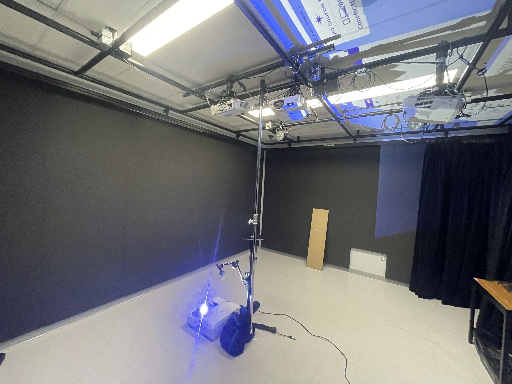
ou
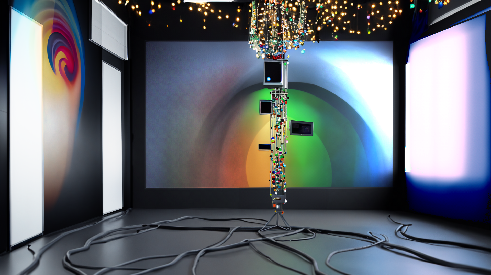
ou

### Est-ce que j'ai accompli l'ensemble des tâches et objectifs que je m'étais fixés pour cette semaine?	
- [x] Complètement
- [ ] Assez
- [ ] Peu
- [ ] Pas du tout

#### Décrivez pourquoi.
J'ai réussi à m'organiser pour avoir le temps de faire tout mes tests et de pouvoir créer mes plans 2D et 3D pour la structure. 

#### S'il y a lieu, qu'allez-vous faire pour remédier à la situation?

### Mon projet s'est-il réalisé selon l’échéancier prévu?

- [x] Complètement
- [ ] Assez
- [ ] Un peu
- [ ] Pas tout à fait

#### S'il y a des écarts, décrivez-les.

#### S'il y a lieu, qu'allez-vous faire pour remédier à la situation?

### Défis pour la prochaine semaine
- Changer l'emplacement des projecteurs.
- Commander le matériels manquants.
- Finir mon test sur le bouton arduino.
- Installer du matériel sur le pole central.

---
## Semaine 2
### Résumé des réalisations effectuées
- Test Arduino
- Test fairylight
- Commencement de la construction de la structure
- Prise des mesures de la structure
- Test des projecteurs
- Création d'un excel pour le matériel et les stratégies pour la création de chacune des étapes

### Image d'une réalisation dont tu es la ou le plus fier
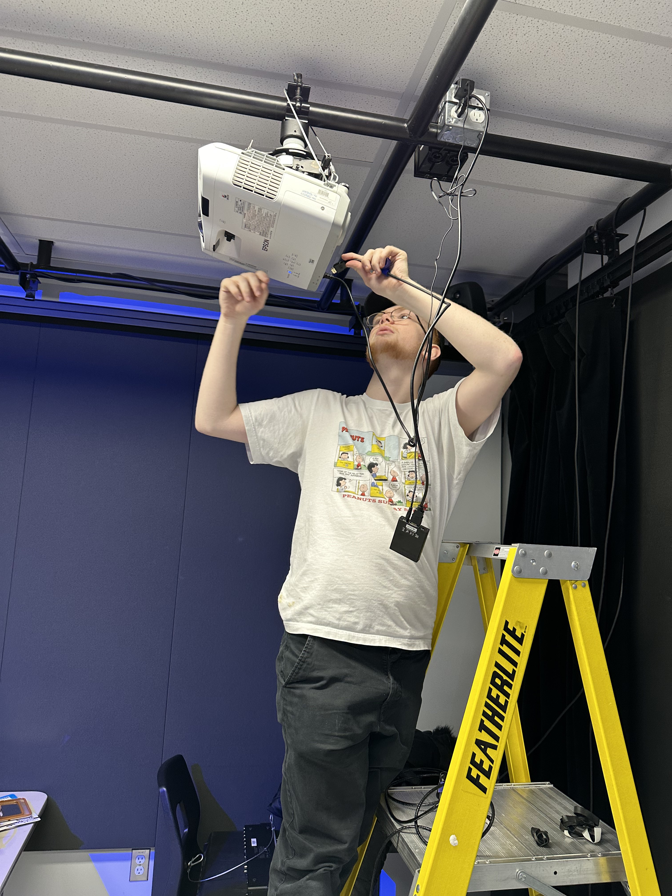
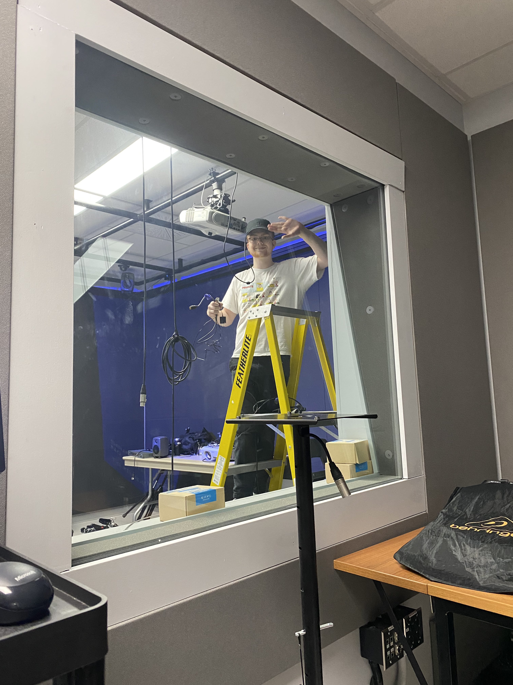

### Est-ce que j'ai accompli l'ensemble des tâches et objectifs que je m'étais fixés pour cette semaine?

- [ ] Complètement
- [x] Assez
- [ ] Peu
- [ ] Pas du tout

#### Décrivez pourquoi.
 J'ai réussi à effectuer beaucoup de choses, mais j'aurais voulais avoir finit une des intéractions dans arduino pour la deuxième semaine.

#### S'il y a lieu, qu'allez-vous faire pour remédier à la situation?
Je vais essayer de me faire un horaire pour pouvoir finir tout ce que je vais prévoir pour cette semaine.

### Mon projet s'est-il réalisé selon l’échéancier prévu?

- [x] Complètement
- [ ] Assez
- [ ] Un peu
- [ ] Pas tout à fait

#### S'il y a des écarts, décrivez-les.

#### S'il y a lieu, qu'allez-vous faire pour remédier à la situation?

### Défis pour la prochaine semaine
- Commander tout le matériels que j'ai besoin pour créer des intéractions
- Tester les composantes comme le TOF sur le matériel acheté
- Finir d'assembler la structure

---
## Semaine 3 
### Résumé des réalisations effectuées
- Montage
- Essaie d'aller chercher un breadboard (erreur fatale)

### Image d'une réalisation dont tu es la ou le plus fier ou non
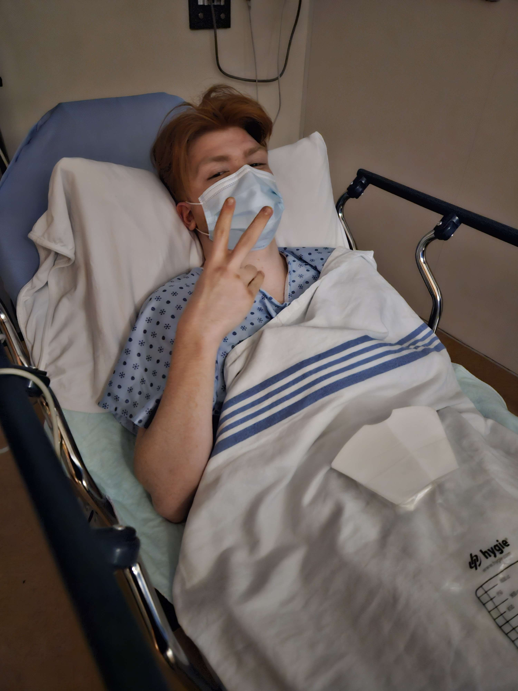
### Est-ce que j'ai accompli l'ensemble des tâches et objectifs que je m'étais fixés pour cette semaine?

- [ ] Complètement
- [ ] Assez
- [ ] Peu
- [x] Pas du tout

#### Décrivez pourquoi.
 Suite à mon aventure de breadboard, je suis tombé sur la glace et j'ai eu une commotion cérébrale donc j'ai dû prendre une semaine de repos.

#### S'il y a lieu, qu'allez-vous faire pour remédier à la situation?
Ne plus aller chercher du matériel à l'extérieur seul.

### Mon projet s'est-il réalisé selon l’échéancier prévu?

- [x] Complètement
- [ ] Assez
- [ ] Un peu
- [ ] Pas tout à fait

#### S'il y a des écarts, décrivez-les.

#### S'il y a lieu, qu'allez-vous faire pour remédier à la situation?

### Défis pour la prochaine semaine
- Me reposer
- Créer un système d'entenoir pour la lumière
- Créer des médias dans TouchDesigner pour les petits écrans
- Créer des médias dans TouchDesigner pour les projections
- Finir la salle pour procédé aux tests
---
## Semaine 4
### Résumé des réalisations effectuées
- Modélisation et Rigging du cerf
- Modélisation et impression 3D du test du système d'entenoir
- Création du moodboard pour le contenu de la projection
- Création du scénarimage pour le contenu de la projection
- Création de visuel pour les petits écrans dans TouchDesigner
- Test de visuel avec le modèle 3D dans TouchDesigner
- Création de FX dans Houdini
- Rencontre d'équipe pour le synopsis du mini film
- Test de la lumière DMX dans le petit studio

### Image d'une réalisation dont tu es la ou le plus fier
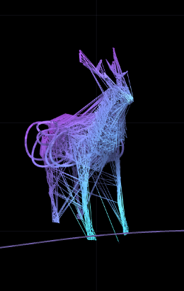
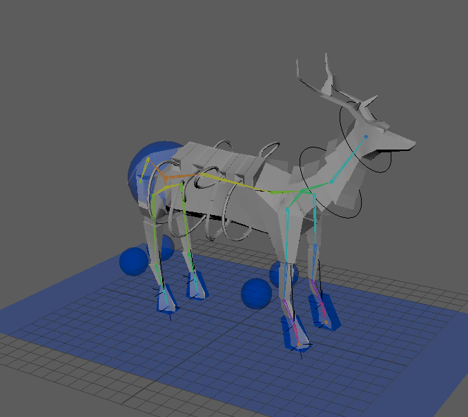
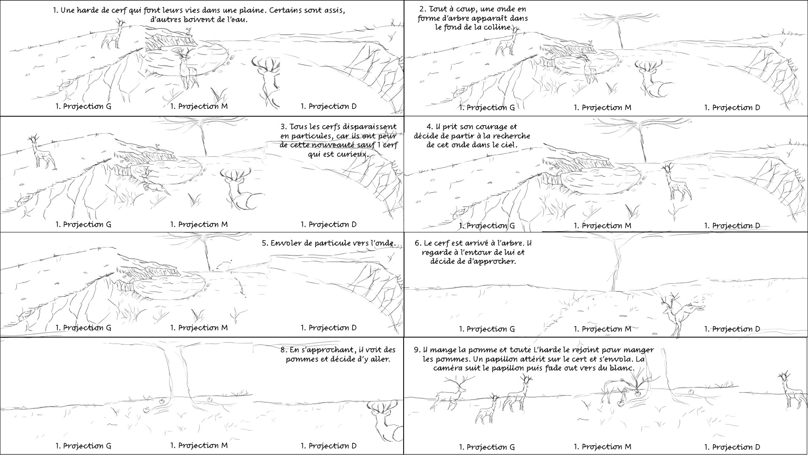

### Est-ce que j'ai accompli l'ensemble des tâches et objectifs que je m'étais fixés pour cette semaine?

- [ ] Complètement
- [x] Assez
- [ ] Peu
- [ ] Pas du tout

#### Décrivez pourquoi.
 J'aurais voulu avoir le temps de finir le Skinning de cerf, mais à la place j'ai fait le storyboard.

#### S'il y a lieu, qu'allez-vous faire pour remédier à la situation?

### Mon projet s'est-il réalisé selon l’échéancier prévu?

- [x] Complètement
- [ ] Assez
- [ ] Un peu
- [ ] Pas tout à fait

#### S'il y a des écarts, décrivez-les.

#### S'il y a lieu, qu'allez-vous faire pour remédier à la situation?

### Défis pour la prochaine semaine
- Finir le modèle de A à Z
- Créer une animation de cerf
- Créer l'environnement en modélisation 3D
---
## Semaine 5
### Résumé des réalisations effectuées
- Modélisation biche
- Refaire la modélisation cerf
- Rig et Skinning du cerf et de la biche
- Modélisation de l'environnement
- Test de l'eau dans blender
- Exportation du rendu de l'eau dans blender
- Test de l'explosion dans blender
- Exportation du rendu de l'explosion
- Test de la décomposition de la montagne
- Exportation de la décomposition de la montagne
- Animation des cerfs et des biche dans maya
- Rencontre pour parler du visuel avec l'équipe
- Test d'animation circulaire dans maya
- Créer les assets pour l'environnement

### Image d'une réalisation dont tu es la ou le plus fier
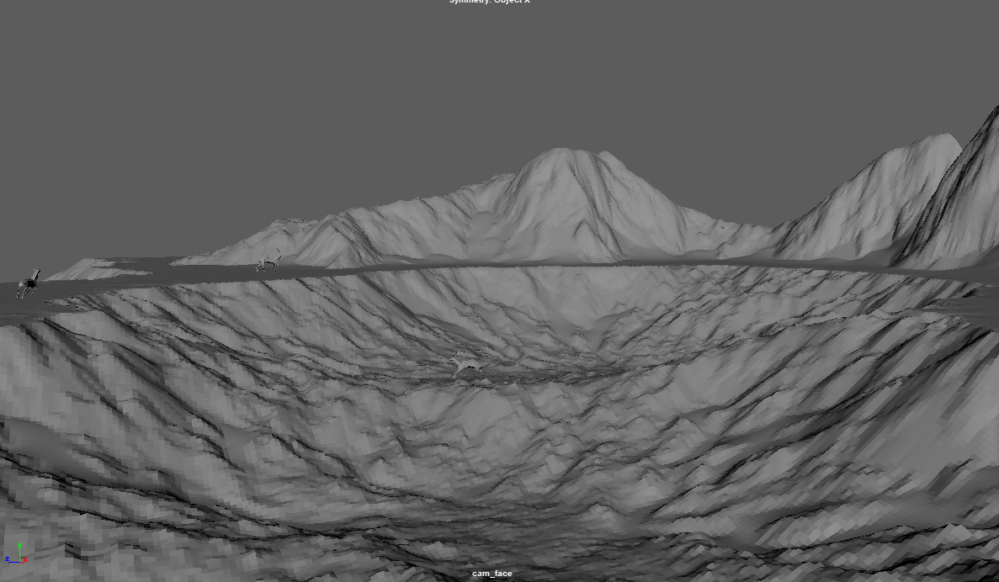

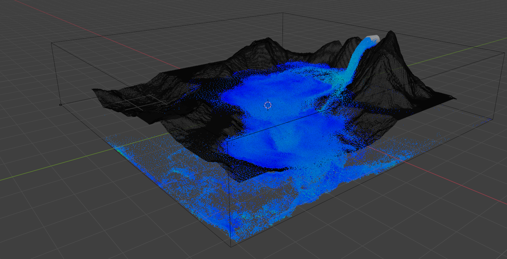
### Est-ce que j'ai accompli l'ensemble des tâches et objectifs que je m'étais fixés pour cette semaine?

- [ ] Complètement
- [x] Assez
- [ ] Peu
- [ ] Pas du tout

#### Décrivez pourquoi.
J'aurais voulu créer plus d'asset et finir plus d'animation différentes pour les cerfs, mais les rendus d'essais ont prit trop de temps. Aussi, j'ai eu beaucoup de problème pour faire les transferts des alembic entre Maya, Houdini et Blender donc cela à prit plus de temps prévu. Par ailleurs, j'ai dû aussi refaire beaucoup de "Bake" pour pouvoir faire de multiple test sur l'eau, la désintégration et le terrain donc cela à prit plus de temps que prévu. Pour finir, j'ai eu des problèmes lorsque j'envoyais mes alembic à Jasmine, car l'alembic faisait 40g et même lorsque je le 7zip, ça prennait beaucoup trop de temps.

#### S'il y a lieu, qu'allez-vous faire pour remédier à la situation?
Je dois plus évaluer le temps que les choses vont me prendre et ne pas sous-estimer les rendus.
### Mon projet s'est-il réalisé selon l’échéancier prévu?

- [ ] Complètement
- [x] Assez
- [ ] Un peu
- [ ] Pas tout à fait

#### S'il y a des écarts, décrivez-les.
Cette semaine tout le monde restaient très tard pour travailler donc je suis vraiment fier de nous. Tout le monde faisait leurs tâches et le projet est sur sa dernière ligne droite.

#### S'il y a lieu, qu'allez-vous faire pour remédier à la situation?

### Défis pour la prochaine semaine
- Finir le mini film
- Finir les dernières animations
- Trouver une solution pour les rendus
- Faire des visuels pour les petits écrans
- Faires des rendus pour les petits écrans
---
## Semaine de rattrapage
### Résumé desréalisations effectuées
- Création particules projection
- Test particules avec les projecteurs
- Test du slider avec la pole
- Faire des rendus
- Ménage
- Achat de matériels
- Décoration du studio

### Image d'une réalisation dont tu es la ou le plus fier
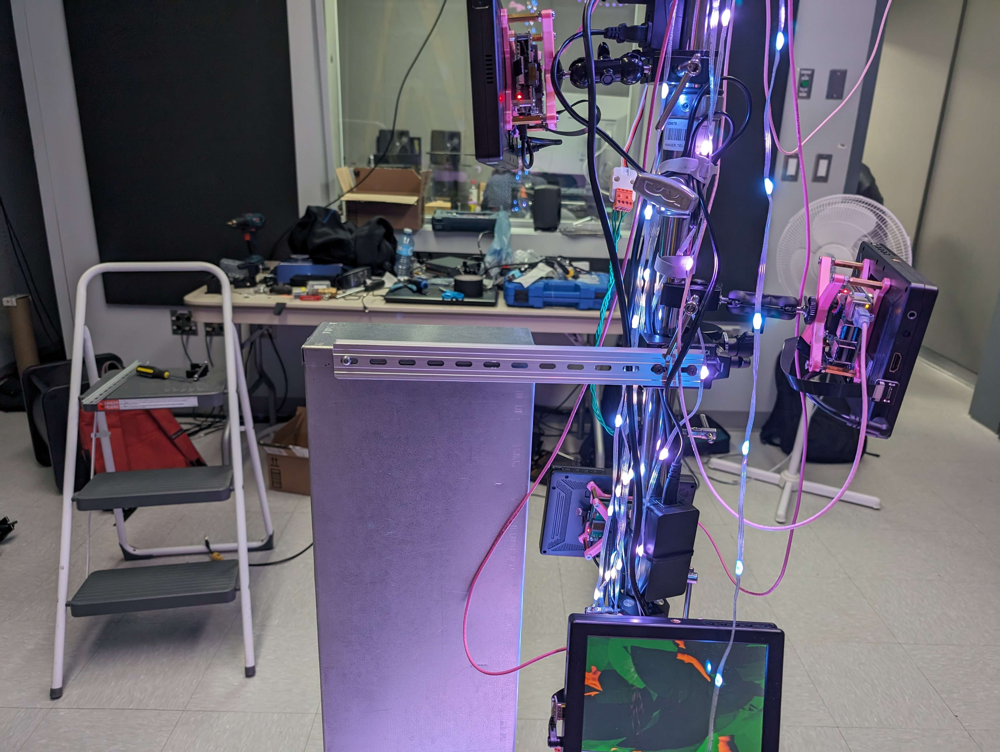
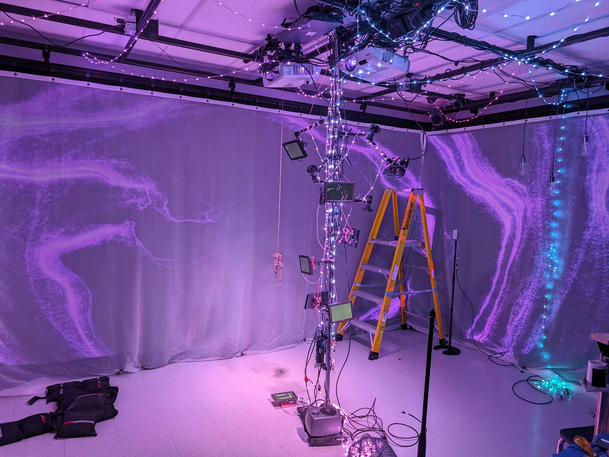
### Est-ce que j'ai accompli l'ensemble des tâches et objectifs que je m'étais fixés pour cette semaine?

- [ ] Complètement
- [x] Assez
- [ ] Peu
- [ ] Pas du tout

#### Décrivez pourquoi.
J'ai bien avancé durant cette semaine, mais j'ai pris quelques jours de repos donc je n'ai pas accomplir l'ensemble des tâches que j'aurais voulu. Aussi les rendus ont prit beaucoup de temps donc je n'ai pas pu finir le mini-film ou débuter le montage.

#### S'il y a lieu, qu'allez-vous faire pour remédier à la situation?

### Mon projet s'est-il réalisé selon l’échéancier prévu?

- [ ] Complètement
- [x] Assez
- [ ] Un peu
- [ ] Pas tout à fait

#### S'il y a des écarts, décrivez-les.
Nous avons beaucoup de problèmes avec le slider et la valve donc nous ne pouvons pas encore montrer de maquette totalement fonctionnelle. J'aurais voulu avoir une maquette fonctionnelle pour pouvoir troubleshoot les problèmes dans les semaines à venir.

#### S'il y a lieu, qu'allez-vous faire pour remédier à la situation?
Nous allons peut-être devoir enlever 1 des éléments pour avoir le temps de finir le projet.

### Défis pour la prochaine semaine
- Trouver une solution pour accrocher le slider
- Finir la colo du mini film
- Finir le montage du mini film
- Troubleshoot des problèmes
- Faire des tests avec le mini film et la projection
- Faire un ménage du studio et le décorer
- Ajouter des tubes RGB à l'entrée du studio
- Trouver une solution pour cacher la régie
---
## Semaine 6
### Résumé des réalisations effectuées
- Trouver une solution pour accrocher le slider
- Colo du mini film
- Finissions du mini film
- Trouver des solutions pour l'exportation du mini film
- Test du mini film avec les projecteurs
- Ajout de lumière RGB dans l'entrée du studio
- Ajout d'un rideau pour cacher la régie
- Ménage du studio
- Troubleshooting de la valve

### Image d'une réalisation dont tu es la ou le plus fier

### Est-ce que j'ai accompli l'ensemble des tâches et objectifs que je m'étais fixés pour cette semaine?

- [x] Complètement
- [ ] Assez
- [ ] Peu
- [ ] Pas du tout

#### Décrivez pourquoi.
J'ai réussi à être productif cette semaine. Je me suis occupé du comité communication, j'ai fini mon montage et j'ai aidé l'équipe à finir leurs tâches. Mon plus gros problème cette semaine était l'exportation du mini film. Pour faire une vidéo en 5760 par 1080 je devais utiliser Premiere pro, je n'avais jamais utilisé ce logiciel donc j'ai eu beaucoup d'erreur de cache lors de mes exportations, mais j'ai trouvé une solution. 

#### S'il y a lieu, qu'allez-vous faire pour remédier à la situation?

### Mon projet s'est-il réalisé selon l’échéancier prévu?

- [ ] Complètement
- [x] Assez
- [ ] Un peu
- [ ] Pas tout à fait

#### S'il y a des écarts, décrivez-les.
Nous avons beaucoup avancé, mais nous avons dû enlever la valve, car elle ne fonctionnait pas et nous devons remettre un projet complet.

#### S'il y a lieu, qu'allez-vous faire pour remédier à la situation?

### Défis pour la prochaine semaine
- Faire des troubleshoot si il y a besoin
- Regarder l'exposition
---
## Semaine 7
### Résumé des réalisations effectuées

### Image d'une réalisation dont tu es la ou le plus fier

### Est-ce que j'ai accompli l'ensemble des tâches et objectifs que je m'étais fixés pour cette semaine?

- [ ] Complètement
- [ ] Assez
- [ ] Peu
- [ ] Pas du tout

#### Décrivez pourquoi.
 

#### S'il y a lieu, qu'allez-vous faire pour remédier à la situation?

### Mon projet s'est-il réalisé selon l’échéancier prévu?

- [ ] Complètement
- [ ] Assez
- [ ] Un peu
- [ ] Pas tout à fait

#### S'il y a des écarts, décrivez-les.

#### S'il y a lieu, qu'allez-vous faire pour remédier à la situation?

### Défis pour la prochaine semaine

## Semaine 8

## Semaine 9
