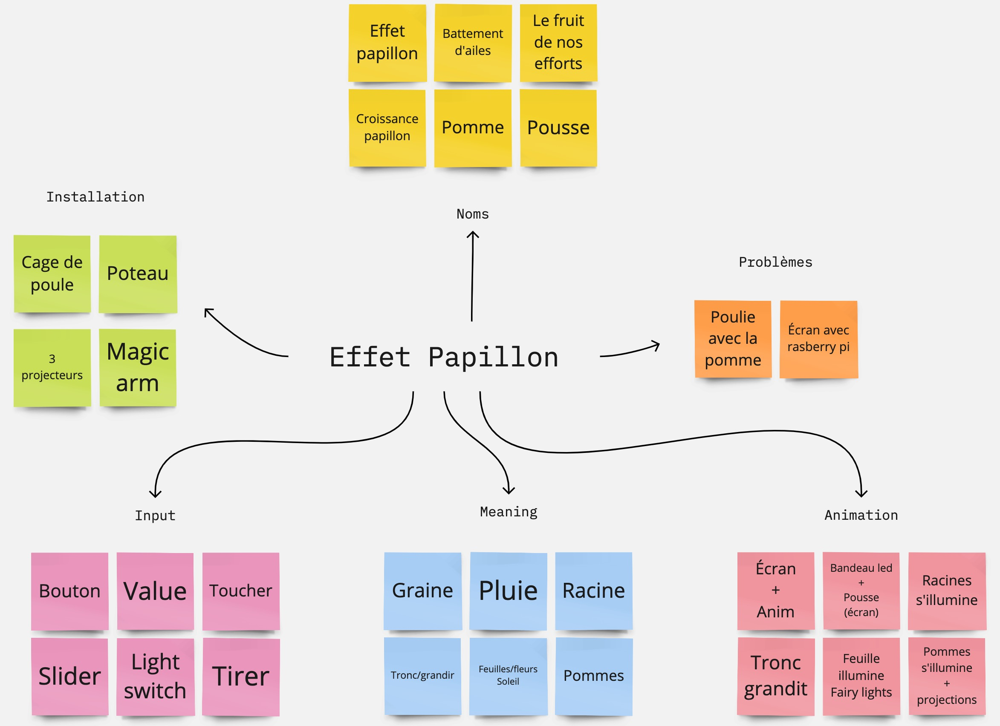
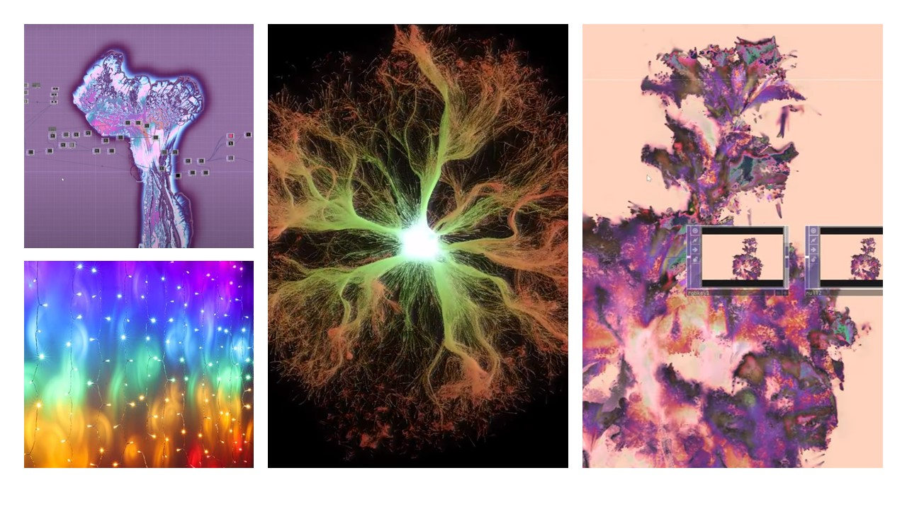
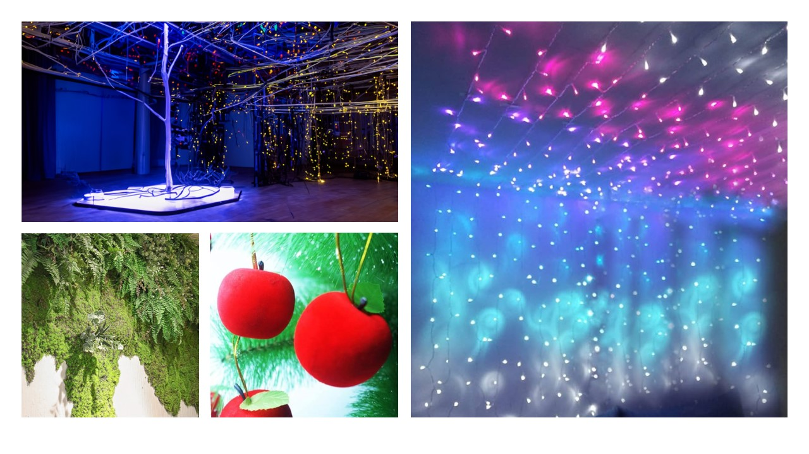

# Préproduction
> C'est ici qu'on dépose les éléments de la préproduction.

# Table des matières
1. [Intention ou concept](#Intention-ou-concept)
    - [Cartographie](#Cartographie)
    - [Intention de départ](#Intention-de-départ)
    - [Synopsis](#Synopsis)
    - [Tableau d'ambiance (*moodboard*)](#Tableau-d'ambiance-(*moodboard*))
    - [Scénario, scénarimage ou document audio/visuel](#Scénario,-scénarimage-ou-document-audio/visuel)
2. [Contenu multimédia à intégrer](#Contenu-multimédia-à-intégrer)
    - [Inventaire du contenu multimédia](#Inventaire-du-contenu-multimédia)
    - [Univers artistique des éléments](#Univers-artistique-des-éléments-centraux)
3. [Planification technique d'un prototype (devis technique)](#Planification-technique-(devis-technique))
    - [Schémas ou plans techniques](#Schémas-ou-plans-techniques)
    - [Matériaux requis](#Matériaux-de-scénographie-requis)
    - [Équipements requis](#Équipements-requis)
    - [Logiciels requis](#Logiciels-requis)
    - [Ressources humaines requises](#Ressources-humaines-requises)
    - [Ressources spatiales requises (rangement et locaux)](#Ressources-spatiales-requises-(rangement-et-locaux))
    - [Contraintes techniques et potentiels problèmes de production](#Contraintes-techniques-et-potentiels-problèmes-de-production)
4. [Planification de la production d'un prototype (budget et étapes de réalisation)](#Planification-de-la-production-(budget-et-étapes-de-réalisation))
    - [Budget prévisionnel](#Budget-prévisionnel)
    - [Échéancier global](#Échéancier-global)
    - [Liste des tâches à réaliser](#Liste-des-tâches-à-réaliser)
    - [Rôles et responsabilités des membres de l'équipe](#Rôles-et-responsabilités-des-membres-de-l'équipe))
    - [Moments des rencontres d'équipe](#Moments-des-rencontres-d'équipe)

# Intention ou concept
## Cartographie

## Intention de départ
L'effet papillon, de petites actions peuvent déclencher des conséquences imprévisibles à long terme.

## Synopsis
Une installation interactive immersive qui explore le cycle de vie d'un pommier tout en mettant en lumière l'effet papillon à travers des éléments électroniques. Les visiteurs sont invités à participer à une expérience sensorielle et éducative qui dévoile les différentes étapes, de la graine à la pomme, tout en soulignant la notion complexe de l'effet papillon. La maturation du fruit est une phase clé de l'installation, où les visiteurs découvrent les conséquences finales de leurs actions. La pomme résultante devient le point focal, représentant les retombées de choix apparemment minuscules sur un système complexe.

## Tableau d'ambiance (*moodboard*)

## Scénario, scénarimage ou document audio/visuel

# Contenu multimédia à intégrer
## Inventaire du contenu multimédia

- Paysages sonores
- Ambiances visuelles
- Contrôle d'éclairage
- Projection
- Interaction

## Univers artistique des éléments
### Inspirations:
[Ambience sonore générale](https://youtu.be/UjpPg0VP1Ng?si=2JolqL7jvhuFTfVv)

[Pluie douce](https://youtu.be/hHGZ1QDpUKI?si=GXbNijXpZ_T_3IMO&t=33)

[Eau qui coule](https://youtu.be/Z3m7HXeiHpg?si=mz4DdJicudAgLthR&t=1052)

[Couches sonores qui s'ajoutent au fur et à mesure](https://youtu.be/a7RTOK4HEaE?si=4_yHDQySFOOmqsvE)

[Bruits techno simulant la nature (bruits d'oiseaux, d'insectes, etc.)](https://youtu.be/UjpPg0VP1Ng?si=2JolqL7jvhuFTfVv&t=226)

[Vent](https://youtu.be/UjpPg0VP1Ng?si=DPQqZtlVBSqx7TLv&t=414)

### Premiers tests:

https://github.com/Iteration6/Effet-Papillon/assets/89608462/4d30ae9a-bb31-4387-bedc-aeb8f14da3c3

# Planification technique d'un prototype (devis technique)
## Schémas ou plans techniques
> Insérer plans, documents et schémas pertinents dans cette sectio.  

### Plantation 

### Schéma de branchement 

## Matériel de scénographie requis
[Tableau des matériaux de scénographie](https://cmontmorency365-my.sharepoint.com/:x:/g/personal/2173985_cmontmorency_qc_ca/Ef2frajDoDlOgnM39c6KDIwBUp3EiCAEkv_r2O8XiAzgpg?e=8mw3j9&nav=MTVfezI1RjU1MEI5LUE1RjMtNDRGNy04RTBGLUU0RjUyQzNGQUJCMH0)

## Équipements requis
[Tableau liste de l'équipements requis](https://cmontmorency365-my.sharepoint.com/:x:/r/personal/2173985_cmontmorency_qc_ca/Documents/Informations%20projet%20final.xlsx?d=wa8ad9ffda0c34e39827337f5ce8a0c8c&csf=1&web=1&e=hHKzlu)

## Logiciels requis
[Tableaul logiciels requis](https://cmontmorency365-my.sharepoint.com/:x:/r/personal/2173985_cmontmorency_qc_ca/Documents/Informations%20projet%20final.xlsx?d=wa8ad9ffda0c34e39827337f5ce8a0c8c&csf=1&web=1&e=i2nGn4)

## Ressources humaines requises
[Tableau ressources humaines requises](https://cmontmorency365-my.sharepoint.com/:x:/r/personal/2173985_cmontmorency_qc_ca/Documents/Informations%20projet%20final.xlsx?d=wa8ad9ffda0c34e39827337f5ce8a0c8c&csf=1&web=1&e=BVRiow)

## Ressources spatiales requises (rangement et locaux)
[Tableau spécifications des espaces nécessaires](https://cmontmorency365-my.sharepoint.com/:x:/r/personal/2173985_cmontmorency_qc_ca/Documents/Informations%20projet%20final.xlsx?d=wa8ad9ffda0c34e39827337f5ce8a0c8c&csf=1&web=1&e=7Pa9Kn)
## Contraintes techniques et potentiels problèmes de production
[Tableau contraintes techniques](https://cmontmorency365-my.sharepoint.com/:x:/r/personal/2173985_cmontmorency_qc_ca/Documents/Informations%20projet%20final.xlsx?d=wa8ad9ffda0c34e39827337f5ce8a0c8c&csf=1&web=1&e=QugJAu)

# Planification de la production d'un prototype (budget et étapes de réalisation)
## Budget prévisionnel
[Lien vers document](https://cmontmorency365-my.sharepoint.com/:x:/r/personal/2173985_cmontmorency_qc_ca/Documents/Informations%20projet%20final.xlsx?d=wa8ad9ffda0c34e39827337f5ce8a0c8c&csf=1&web=1&e=mxiJBH)

## Échéancier global
Étapes importantes du projet :  
[https://github.com/tim-montmorency/66B-modele_de_projet/milestones](https://github.com/RealiteCroisee/Projet-Finissant-Realite-Croisee/milestones)

*Dates importantes :*
- Présentation itération prototype : Jeudi 29 février
- Révision Finale : Jeudi 7 mars
- Événement de présentation publique : Vendredi 15 mars

## Liste des tâches à réaliser
Visualisation des tâches à réaliser dans GitHub selon la méthode Kanban:  
[Onglet Projet](https://github.com/orgs/RealiteCroisee/projects/1/views/1)

Inventaire des tâches à réaliser dans GitHub selon le répertoire d'*issues*:  
[Onglet Issues](https://github.com/RealiteCroisee/Projet-Finissant-Realite-Croisee/issues)

## Rôles et responsabilités des membres de l'équipe

**Raphaël Dumont**
- Coordination générale du projet (coordination de l'échéancier, du budget, suivi de la liste des tâches à réaliser, s'assurer de la répartition du rôle et des responsabilités des membres de l'équipe);
- Création du module d'interprétation des données;

Liste des tâches dans Git Hub:  
[Issues](https://github.com/RealiteCroisee/Projet-Finissant-Realite-Croisee/issues?q=is%3Aopen+assignee%3ARaphBarniques) 

[Project](https://github.com/orgs/RealiteCroisee/projects/1/views/1?filterQuery=assignee%3ARaphBarniques)

**Viktor Zhuravlev**
- Assurance qualité;
- Coordinateur son;
- Création des paysages sonores;
- Intégration des sons dans l'espace physique;
- Installation de l'équipement dans l'espace physique.

Liste des tâches dans Git Hub:  
[Issues](https://github.com/RealiteCroisee/Projet-Finissant-Realite-Croisee/issues?q=is%3Aopen+assignee%3AV1ti0)

[Project](https://github.com/orgs/RealiteCroisee/projects/1/views/1?filterQuery=assignee%3AV1ti0)

**William Morel**
- Comité Technique et coordination technique (suivi du devis technique);
- Intégrateur (imaginer, créer et mettre en place les décors sur la scène.)
- Installation et mise en place des casques de réalité virtuelle et des appareils de captations;
- Programmation du mapping vidéo pour la projection.

Liste des tâches dans Git Hub:  
[Issues](https://github.com/RealiteCroisee/Projet-Finissant-Realite-Croisee/issues?q=is%3Aopen+assignee%3AMorelWilliam+) 

[Project](https://github.com/orgs/RealiteCroisee/projects/1/views/1?filterQuery=assignee%3AMorelWilliam)

**Alexis Bolduc**
- Coordination artistique (attention plus particulière pour s'assurer que l'intention/concept artistique du projet initial reste, sinon consulter les membres de l'équipe);
- Création d'animation générative;
- Création d'animation pour la projection;
- Programmation du casque de réalité virtuelle avec Touch Designer;

Liste des tâches dans Git Hub:  
[issues](https://github.com/RealiteCroisee/Projet-Finissant-Realite-Croisee/issues?q=is%3Aopen+assignee%3AAlexisBolduc1)

[Project](https://github.com/orgs/RealiteCroisee/projects/1/views/1?filterQuery=assignee%3AAlexisBolduc1)

**Ryan Papanikolaou**
- Artiste visuel;
- Directeur lumière;
- Intégration des lumières dans l'espace physique;
- Programmation du module Touch Designer d'éclairage;

Liste des tâches dans Git Hub:  
[Issues](https://github.com/RealiteCroisee/Projet-Finissant-Realite-Croisee/issues?q=is%3Aopen+assignee%3AAPapanik09) 

[Project](https://github.com/orgs/RealiteCroisee/projects/1/views/1?filterQuery=assignee%3AAPapanik09)

**Jasmine Lapierre**
- Intégrateur (imaginer, créer et mettre en place les décors sur la scène);
- Programmation du mapping vidéo pour la projection;

Liste des tâches dans Git Hub:  
[Issues](https://github.com/RealiteCroisee/Projet-Finissant-Realite-Croisee/issues?q=is%3Aopen+assignee%3AJasmine-Lapierre)

[Project](https://github.com/orgs/RealiteCroisee/projects/1/views/1?filterQuery=assignee%3A%22Jasmine-Lapierre%22)

**Tâches pas encore attribuées**  
[Issues](https://github.com/RealiteCroisee/Projet-Finissant-Realite-Croisee/issues?q=is%3Aopen+no%3Aassignee)

[Project](https://github.com/orgs/RealiteCroisee/projects/1/views/1?filterQuery=no%3Aassignee)

## Moments des rencontres d'équipe
Hebdomadaire
- **Lundi 10h (1h-2h)** : Rencontre de suivi de projet.

Autre: 
- **"y" jour "x"h (1h-2h)** : Rencontre de suivi de projet.

# Jeudi artistique 

 

## Semaine 1 

### Public cible 

Explorateurs

### Quatre éléments spécifiques au médium de l’interactivité 

Comportement de l’interacteur :  

L’interacteur vient interagir avec la structure directement afin de changer l’environnement autour de lui et la structure en elle-même. Les interactions sont variées comme des boutons, des leviers ou simplement les mouvements de l’interacteur. 

Esthétique : 

Notre objectif est de représenter un pommier alors l’esthétique vient principalement s’inspirer de la nature à la fois sur le visuel et sur l’ambiance sonore. Cependant, le décor aura également beaucoup lumière qui viendra rajouter de la couleur à notre esthétique. Le pommier sera un pommier électronique, une sorte de cyber-pommier.

Espace : 

La taille du petit studio nous permet de créer une ambiance immersive grâce à la projection et aux lumières. Dans les écran on représentera le pommier de manière plus concrète, comment on le voit de l'extérieur.

Temps : 

L’expérience commencera avec un bouton à appuyer et se terminera lorsque la pomme sera tirée. La progression se fera une étape après l’autre jusqu’au résultat final. Puis par la suite toute l'expérience recommence du début à la fin.

### Quelles émotions voulez-vous faire vivre à l’interacteur ? Pourquoi ? 

L’objectif est de faire vivre plusieurs émotions auprès de l’interacteur. L’objectif principal de l’installation est de faire vivre la curiosité en encourageant l’exploration mais aussi de faire vivre une sorte d’accomplissement lorsqu’on arrive à la fin du pommier. Également, la surprise de ce que nos choix qui parfois semble insignifiant peuvent engendrer, amenant ainsi une réflexion sur les gestes qu’on pose au quotidien. Finalement, de la contemplation et de l’émerveillement face devant les différentes étapes mais surtout à la fin lorsque le pommier donne une pomme et vient mettre en lumière toute la salle. 

### Quelles questions votre projet met-il dans l’esprit de l’interacteur ? 

Le projet suscite des questions sur les liens entre nos actions et les conséquences à long terme, en illustrant l'effet papillon à travers l'évolution d'un pommier interactif.  

Comment mes actions spécifiques dans cette installation influencent-elles le développement du pommier et les événements qui en découlent ? 

Quel est le lien entre les choix que je fais ici et les conséquences qui se déroulent tout au long de la croissance de l'arbre ? 

En quoi les petites interactions peuvent-elles avoir un impact significatif sur le résultat final du pommier et de son environnement ? 

### Que devrez-vous faire pour qu’il ait envie de réponde à ces questions ? 

Créer une expérience immersive captivante. 

Intégrer des éléments visuels, tactiles et sonores engageants dans l'évolution du pommier, tout en assurant que chaque interaction ait un impact visible et clair, pour inciter les interacteurs à explorer et à expérimenter. 

Rendre le tout évident et compréhensible, en utilisant des mécanismes efficaces qui représente bien le message que l’on veut faire passer mais en les motivant à rester du début à la fin de l’expérience. 

## Semaine 2 

### 1. Listez tous les verbes (actions basiques) disponibles à vos interacteurs. 

- Tourner 

- Appuyer 

- Tirer 

- Déplacer 

- Allumer 

### 2. Listez tous les objets sur lesquels chaque verbe peut agir et comment ils le font. 

- Tourner la valve 

- Appuyer sur le bouton qui allume 

- Tirer sur la pomme 

- Déplacer le bouton sur le slider 

- Allumer les lumières à l’aide de light switch 

 

### 3. Listez plusieurs actions émergentes que vous aimeriez que vos interacteurs effectuent. 

 

### 4. Listez toutes les façons que les interacteurs peuvent faire progresser l’expérience. 

 

### Logo de l’équipe 

 

### Bannière de l’équipe 

 

### Paragraphe du projet 

Comme les battements d'ailes d'un papillon peuvent déclencher une réaction en chaîne, chaque petite croissance et soin prodigué à un pommier crée un effet papillon, propageant la vitalité de ses racines jusqu'au sommet de ses fruits florissants.  

Plongez dans une expérience immersive où l'interacteur devient le maître de sa propre réalité avec l'œuvre intitulée 'Effet Papillon'. Cette installation unique invite les participants à interagir directement avec la structure, modifiant ainsi l'environnement qui les entoure ainsi que la structure elle-même. Les interactions, qu'elles soient générées par des boutons ou des leviers offrent une diversité d'expériences sensorielles. 

L'esthétique de l'œuvre est centrée autour de la représentation d'un pommier, s'inspirant principalement de la nature tant au niveau visuel qu'auditif. Le décor, tout en évoquant la nature, intègre également une abondance de lumière pour enrichir l'esthétique globale de l'installation. 
