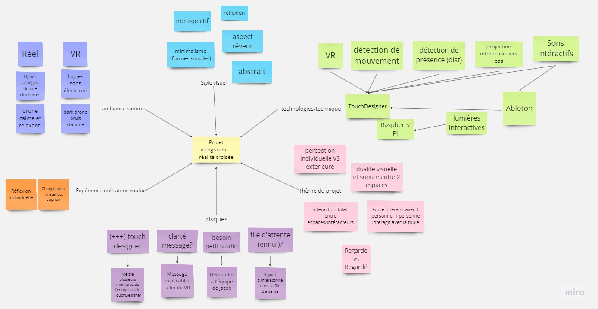
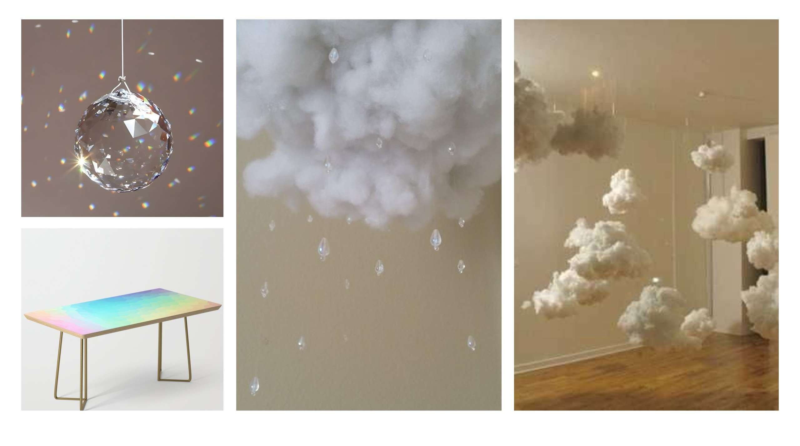
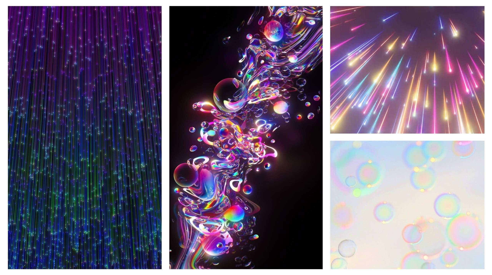
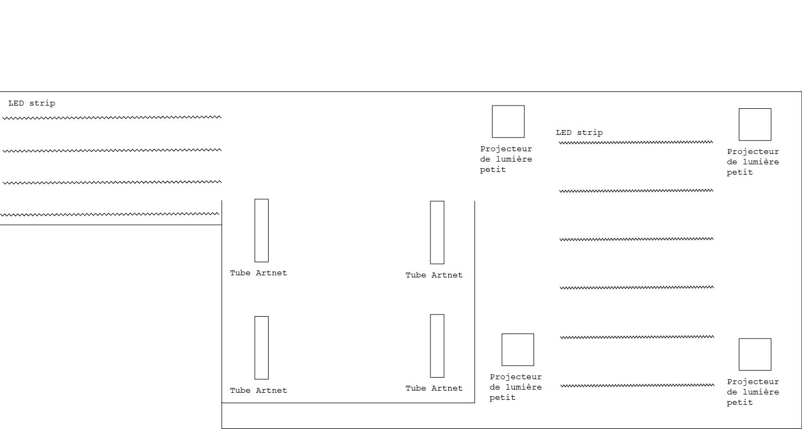
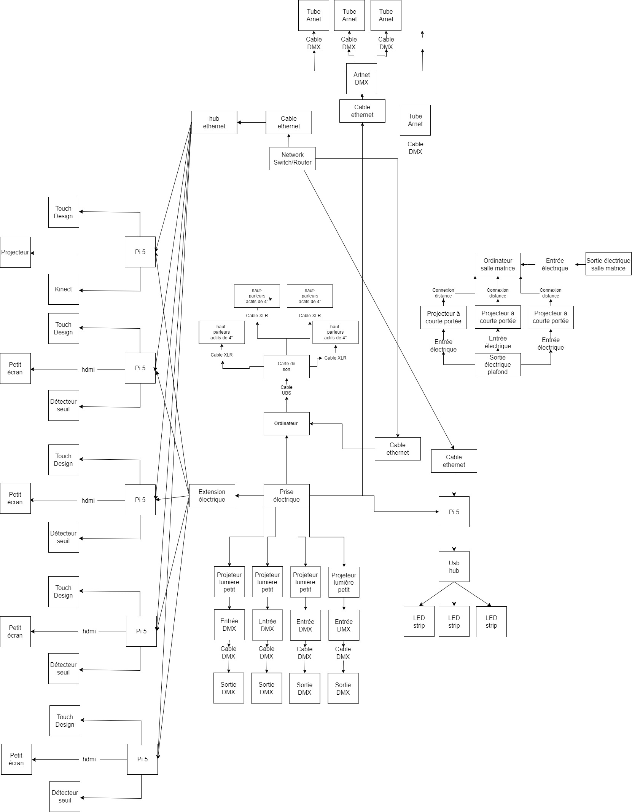

# Préproduction
> C'est ici qu'on dépose les éléments de la préproduction.

# Table des matières
1. [Intention ou concept](#Intention-ou-concept)
    - [Cartographie](#Cartographie)
    - [Intention de départ](#Intention-de-départ)
    - [Synopsis](#Synopsis)
    - [Tableau d'ambiance (*moodboard*)](#Tableau-d'ambiance-(*moodboard*))
    - [Scénario, scénarimage ou document audio/visuel](#Scénario,-scénarimage-ou-document-audio/visuel)
2. [Contenu multimédia à intégrer](#Contenu-multimédia-à-intégrer)
    - [Inventaire du contenu multimédia](#Inventaire-du-contenu-multimédia)
    - [Univers artistique des éléments](#Univers-artistique-des-éléments-centraux)
3. [Planification technique d'un prototype (devis technique)](#Planification-technique-(devis-technique))
    - [Schémas ou plans techniques](#Schémas-ou-plans-techniques)
    - [Matériaux requis](#Matériaux-de-scénographie-requis)
    - [Équipements requis](#Équipements-requis)
    - [Logiciels requis](#Logiciels-requis)
    - [Ressources humaines requises](#Ressources-humaines-requises)
    - [Ressources spatiales requises (rangement et locaux)](#Ressources-spatiales-requises-(rangement-et-locaux))
    - [Contraintes techniques et potentiels problèmes de production](#Contraintes-techniques-et-potentiels-problèmes-de-production)
4. [Planification de la production d'un prototype (budget et étapes de réalisation)](#Planification-de-la-production-(budget-et-étapes-de-réalisation))
    - [Budget prévisionnel](#Budget-prévisionnel)
    - [Échéancier global](#Échéancier-global)
    - [Liste des tâches à réaliser](#Liste-des-tâches-à-réaliser)
    - [Rôles et responsabilités des membres de l'équipe](#Rôles-et-responsabilités-des-membres-de-l'équipe))
    - [Moments des rencontres d'équipe](#Moments-des-rencontres-d'équipe)

# Intention ou concept
## Cartographie

## Intention de départ
Montrer que ce que l'on ressent à l'intérieur est différent de ce que les gens voient.

## Synopsis
Une installation VR où le participant, plongé dans un monde dystopique, voit l'horreur à travers son casque. Pendant ce temps, les spectateurs extérieurs découvrent un monde utopique. La divergence entre la vision individuelle et collective crée un contraste saisissant, suscitant la curiosité des spectateurs et les incitant à essayer le casque pour vivre l'expérience eux-mêmes. L'installation explore la subjectivité de la réalité et invite à réfléchir sur la perception individuelle.

## Tableau d'ambiance (*moodboard*)

## Scénario, scénarimage ou document audio/visuel

# Contenu multimédia à intégrer
## Inventaire du contenu multimédia

- 2 paysages sonores
- 2 ambiances visuelles différentes
- Récupération des données dans le casque
- Contrôle d'éclairage
- Projection
- Interaction pour les gens en attente

## Univers artistique des éléments

[Son calme](https://www.youtube.com/watch?v=UjpPg0VP1Ng)
[Son sombre](https://www.youtube.com/watch?v=1zkoprENdAo&list=PL6dF4LyI8Ll61AbDARhy4RDgx9h_Jc5E)
[Voix transformées](https://www.youtube.com/watch?v=RuctYsaLals)

[Art génératif](https://www.youtube.com/watch?v=qtPi0JvmWbs&list=PLKh_nRCyIl_r16eILxs3M8TDoXBQ1gu9O&index=29)

[Dans le casque](https://www.youtube.com/watch?v=c-4oNyNuu9U)
[Dans le casque](https://www.youtube.com/watch?v=eW1RMWteuHo)

[Extérieur du casque](https://www.youtube.com/watch?v=VoZybflbabQ)
[Extérieur du casque](https://www.youtube.com/watch?v=9csQjBp7iPo)

# Planification technique d'un prototype (devis technique)
## Schémas ou plans techniques
> Insérer plans, documents et schémas pertinents dans cette sectio.  

### Plantation 

### Schéma de branchement 

## Matériel de scénographie requis
[Tableau des matériaux de scénographie](https://cmontmorency365-my.sharepoint.com/:x:/g/personal/2173985_cmontmorency_qc_ca/Ef2frajDoDlOgnM39c6KDIwBUp3EiCAEkv_r2O8XiAzgpg?e=8mw3j9&nav=MTVfezI1RjU1MEI5LUE1RjMtNDRGNy04RTBGLUU0RjUyQzNGQUJCMH0)

## Équipements requis
[Tableau liste de l'équipements requis](https://cmontmorency365-my.sharepoint.com/:x:/r/personal/2173985_cmontmorency_qc_ca/Documents/Informations%20projet%20final.xlsx?d=wa8ad9ffda0c34e39827337f5ce8a0c8c&csf=1&web=1&e=hHKzlu)

## Logiciels requis
[Tableaul logiciels requis](https://cmontmorency365-my.sharepoint.com/:x:/r/personal/2173985_cmontmorency_qc_ca/Documents/Informations%20projet%20final.xlsx?d=wa8ad9ffda0c34e39827337f5ce8a0c8c&csf=1&web=1&e=i2nGn4)

## Ressources humaines requises
[Tableau ressources humaines requises](https://cmontmorency365-my.sharepoint.com/:x:/r/personal/2173985_cmontmorency_qc_ca/Documents/Informations%20projet%20final.xlsx?d=wa8ad9ffda0c34e39827337f5ce8a0c8c&csf=1&web=1&e=BVRiow)

## Ressources spatiales requises (rangement et locaux)
[Tableau spécifications des espaces nécessaires](https://cmontmorency365-my.sharepoint.com/:x:/r/personal/2173985_cmontmorency_qc_ca/Documents/Informations%20projet%20final.xlsx?d=wa8ad9ffda0c34e39827337f5ce8a0c8c&csf=1&web=1&e=7Pa9Kn)
## Contraintes techniques et potentiels problèmes de production
[Tableau contraintes techniques](https://cmontmorency365-my.sharepoint.com/:x:/r/personal/2173985_cmontmorency_qc_ca/Documents/Informations%20projet%20final.xlsx?d=wa8ad9ffda0c34e39827337f5ce8a0c8c&csf=1&web=1&e=QugJAu)

# Planification de la production d'un prototype (budget et étapes de réalisation)
## Budget prévisionnel
[Lien vers document](https://cmontmorency365-my.sharepoint.com/:x:/r/personal/2173985_cmontmorency_qc_ca/Documents/Informations%20projet%20final.xlsx?d=wa8ad9ffda0c34e39827337f5ce8a0c8c&csf=1&web=1&e=mxiJBH)

## Échéancier global
Étapes importantes du projet :  
[https://github.com/tim-montmorency/66B-modele_de_projet/milestones](https://github.com/RealiteCroisee/Projet-Finissant-Realite-Croisee/milestones)

*Dates importantes :*
- Présentation itération prototype : Jeudi 29 février
- Révision Finale : Jeudi 7 mars
- Événement de présentation publique : Vendredi 15 mars

## Liste des tâches à réaliser
Visualisation des tâches à réaliser dans GitHub selon la méthode Kanban:  
[Onglet Projet](https://github.com/orgs/RealiteCroisee/projects/1/views/1)

Inventaire des tâches à réaliser dans GitHub selon le répertoire d'*issues*:  
[Onglet Issues](https://github.com/RealiteCroisee/Projet-Finissant-Realite-Croisee/issues)

## Rôles et responsabilités des membres de l'équipe

**Raphaël Dumont**
- Coordination générale du projet (coordination de l'échéancier, du budget, suivi de la liste des tâches à réaliser, s'assurer de la répartition du rôle et des responsabilités des membres de l'équipe);
- Création du module d'interprétation des données;

Liste des tâches dans Git Hub:  
[Issues](https://github.com/RealiteCroisee/Projet-Finissant-Realite-Croisee/issues?q=is%3Aopen+assignee%3ARaphBarniques) 

[Project](https://github.com/orgs/RealiteCroisee/projects/1/views/1?filterQuery=assignee%3ARaphBarniques)

**Viktor Zhuravlev**
- Assurance qualité;
- Création des paysages sonores;
- Intégration des sons dans l'espace physique;
- Installation de l'équipement dans l'espace physique.

Liste des tâches dans Git Hub:  
[Issues](https://github.com/RealiteCroisee/Projet-Finissant-Realite-Croisee/issues?q=is%3Aopen+assignee%3AV1ti0)

[Project](https://github.com/orgs/RealiteCroisee/projects/1/views/1?filterQuery=assignee%3AV1ti0)

**William Morel**
- Comité Technique et coordination technique (suivi du devis technique);
- Intégrateur (imaginer, créer et mettre en place les décors sur la scène.)
- Installation et mise en place des casques de réalité virtuelle et des appareils de captations;
- Programmation du mapping vidéo pour la projection.

Liste des tâches dans Git Hub:  
[Issues](https://github.com/RealiteCroisee/Projet-Finissant-Realite-Croisee/issues?q=is%3Aopen+assignee%3AMorelWilliam+) 

[Project](https://github.com/orgs/RealiteCroisee/projects/1/views/1?filterQuery=assignee%3AMorelWilliam)

**Alexis Bolduc**
- Coordination artistique (attention plus particulière pour s'assurer que l'intention/concept artistique du projet initial reste, sinon consulter les membres de l'équipe);
- Création d'animation générative;
- Création d'animation pour la projection;
- Programmation du casque de réalité virtuelle avec Touch Designer;

Liste des tâches dans Git Hub:  
[issues](https://github.com/RealiteCroisee/Projet-Finissant-Realite-Croisee/issues?q=is%3Aopen+assignee%3AAlexisBolduc1)

[Project](https://github.com/orgs/RealiteCroisee/projects/1/views/1?filterQuery=assignee%3AAlexisBolduc1)

**Ryan Papanikolaou**
- Coordination générale de l'équipe;
- Design Visuel;
- Technicien lumière;
- Création des lumières;
- Intégration des lumières dans l'espace physique;
- Programmation du module Touch Designer d'éclairage;

Liste des tâches dans Git Hub:  
[Issues](https://github.com/RealiteCroisee/Projet-Finissant-Realite-Croisee/issues?q=is%3Aopen+assignee%3AAPapanik09) 

[Project](https://github.com/orgs/RealiteCroisee/projects/1/views/1?filterQuery=assignee%3AAPapanik09)

**Jasmine Lapierre**
- Intégrateur (imaginer, créer et mettre en place les décors sur la scène.)
- Installation et mise en place des casques de réalité virtuelle et des appareils de captations;
- Programmation de Unity;
- Programmation du mapping vidéo pour la projection.

Liste des tâches dans Git Hub:  
[Issues](https://github.com/RealiteCroisee/Projet-Finissant-Realite-Croisee/issues?q=is%3Aopen+assignee%3AJasmine-Lapierre)

[Project](https://github.com/orgs/RealiteCroisee/projects/1/views/1?filterQuery=assignee%3A%22Jasmine-Lapierre%22)

**Tâches pas encore attribuées**  
[Issues](https://github.com/RealiteCroisee/Projet-Finissant-Realite-Croisee/issues?q=is%3Aopen+no%3Aassignee)

[Project](https://github.com/orgs/RealiteCroisee/projects/1/views/1?filterQuery=no%3Aassignee)

## Moments des rencontres d'équipe
Hebdomadaire
- **Lundi 10h (1h-2h)** : Rencontre de suivi de projet.

Autre: 
- **"y" jour "x"h (1h-2h)** : Rencontre de suivi de projet.
